# 🔌 Python API Starter - Complete Implementation Guide

**Section 5 of 8: Enterprise Plugins & Advanced Features**

---

## 📑 Table of Contents

- [🔌 Enterprise Plugins & Advanced Features](#-enterprise-plugins--advanced-features)
  - [Plugin Ecosystem Overview](#-plugin-ecosystem-overview)
  - [Caching Plugin (Redis & Memory)](#-caching-plugin-redis--memory)
  - [GraphQL Plugin (Strawberry)](#-graphql-plugin-strawberry)
  - [gRPC Plugin (Protocol Buffers)](#-grpc-plugin-protocol-buffers)
  - [Metrics Plugin (Prometheus)](#-metrics-plugin-prometheus)
  - [Tracing Plugin (OpenTelemetry)](#-tracing-plugin-opentelemetry)
  - [Rate Limiting Plugin](#-rate-limiting-plugin)
  - [Authentication Plugin](#-authentication-plugin)
  - [CORS & Security](#-cors--security)
  - [Plugin Composition Patterns](#-plugin-composition-patterns)
  - [Performance Optimization](#-performance-optimization)
  - [Complete Enterprise Example](#-complete-enterprise-example)

---

## 🌐 Plugin Ecosystem Overview

### Available Enterprise Plugins

```mermaid
graph TB
    subgraph CORE ["🧠    Core    Framework"]
        C1[APIStarter<br/>Main application]
    end

    subgraph CACHING ["💾    Caching    Layer"]
        CA1[🔴 Redis Backend<br/>Distributed cache]
        CA2[💿 Memory Backend<br/>Local cache]
        CA3[🔄 Cache Invalidation<br/>TTL & Manual]
    end

    subgraph PROTOCOLS ["🔌    Protocol    Plugins"]
        PR1[🌐 HTTP/REST<br/>Built-in Starlette]
        PR2[🔮 GraphQL<br/>Strawberry schema]
        PR3[⚡ gRPC<br/>Protocol Buffers]
    end

    subgraph OBSERVABILITY ["📊    Observability    Stack"]
        OB1[📈 Prometheus Metrics<br/>Request counts, latency]
        OB2[🔍 OpenTelemetry Traces<br/>Distributed tracing]
        OB3[📝 Structured Logging<br/>JSON logs]
    end

    subgraph SECURITY ["🔒    Security    Layer"]
        SE1[🚦 Rate Limiting<br/>Request throttling]
        SE2[🔐 Authentication<br/>JWT, API keys]
        SE3[🛡️ Authorization<br/>RBAC, permissions]
        SE4[🔒 CORS<br/>Cross-origin policy]
    end

    subgraph ENHANCEMENT ["✨    Enhancement    Plugins"]
        EN1[📄 API Documentation<br/>OpenAPI/Swagger]
        EN2[🗜️ Compression<br/>Gzip responses]
        EN3[⏱️ Request Timeouts<br/>Prevent hangs]
        EN4[🔄 Retries<br/>Fault tolerance]
    end

    %% Core to all plugins - Blue
    C1 --> CA1
    C1 --> CA2
    C1 --> PR1
    C1 --> PR2
    C1 --> PR3
    C1 --> OB1
    C1 --> OB2
    C1 --> SE1
    C1 --> SE2
    C1 --> EN1
    linkStyle 0 stroke:#1976d2,stroke-width:3px
    linkStyle 1 stroke:#1976d2,stroke-width:3px
    linkStyle 2 stroke:#1976d2,stroke-width:3px
    linkStyle 3 stroke:#1976d2,stroke-width:3px
    linkStyle 4 stroke:#1976d2,stroke-width:3px
    linkStyle 5 stroke:#1976d2,stroke-width:3px
    linkStyle 6 stroke:#1976d2,stroke-width:3px
    linkStyle 7 stroke:#1976d2,stroke-width:3px
    linkStyle 8 stroke:#1976d2,stroke-width:3px
    linkStyle 9 stroke:#1976d2,stroke-width:3px

    %% Caching internal - Purple
    CA1 --> CA3
    CA2 --> CA3
    linkStyle 10 stroke:#7b1fa2,stroke-width:2px
    linkStyle 11 stroke:#7b1fa2,stroke-width:2px

    %% Observability internal - Teal
    OB1 --> OB3
    OB2 --> OB3
    linkStyle 12 stroke:#00695c,stroke-width:2px
    linkStyle 13 stroke:#00695c,stroke-width:2px

    %% Security internal - Orange
    SE1 --> SE4
    SE2 --> SE3
    linkStyle 14 stroke:#f57c00,stroke-width:2px
    linkStyle 15 stroke:#f57c00,stroke-width:2px

    %% Enhancement internal - Green
    EN1 --> EN2
    EN2 --> EN3
    EN3 --> EN4
    linkStyle 16 stroke:#388e3c,stroke-width:2px
    linkStyle 17 stroke:#388e3c,stroke-width:2px
    linkStyle 18 stroke:#388e3c,stroke-width:2px

    %% Subgraph styling
    style CORE fill:#e8f4fd,stroke:#1976d2,stroke-width:3px,color:#000
    style CACHING fill:#f8f0ff,stroke:#7b1fa2,stroke-width:3px,color:#000
    style PROTOCOLS fill:#f0fffe,stroke:#00695c,stroke-width:3px,color:#000
    style OBSERVABILITY fill:#fff4e6,stroke:#f57c00,stroke-width:3px,color:#000
    style SECURITY fill:#f0f8f0,stroke:#388e3c,stroke-width:3px,color:#000
    style ENHANCEMENT fill:#fef7f7,stroke:#c2185b,stroke-width:3px,color:#000

    %% Node styling
    style C1 fill:#e3f2fd,stroke:#1976d2,stroke-width:3px,color:#000
    
    style CA1 fill:#f3e5f5,stroke:#7b1fa2,stroke-width:2px,color:#000
    style CA2 fill:#f3e5f5,stroke:#7b1fa2,stroke-width:2px,color:#000
    style CA3 fill:#f3e5f5,stroke:#7b1fa2,stroke-width:2px,color:#000
    
    style PR1 fill:#e0f2f1,stroke:#00695c,stroke-width:2px,color:#000
    style PR2 fill:#e0f2f1,stroke:#00695c,stroke-width:2px,color:#000
    style PR3 fill:#e0f2f1,stroke:#00695c,stroke-width:2px,color:#000
    
    style OB1 fill:#fff8e1,stroke:#f57c00,stroke-width:2px,color:#000
    style OB2 fill:#fff8e1,stroke:#f57c00,stroke-width:2px,color:#000
    style OB3 fill:#fff8e1,stroke:#f57c00,stroke-width:2px,color:#000
    
    style SE1 fill:#e8f5e8,stroke:#388e3c,stroke-width:2px,color:#000
    style SE2 fill:#e8f5e8,stroke:#388e3c,stroke-width:2px,color:#000
    style SE3 fill:#e8f5e8,stroke:#388e3c,stroke-width:2px,color:#000
    style SE4 fill:#e8f5e8,stroke:#388e3c,stroke-width:2px,color:#000
    
    style EN1 fill:#fce4ec,stroke:#c2185b,stroke-width:2px,color:#000
    style EN2 fill:#fce4ec,stroke:#c2185b,stroke-width:2px,color:#000
    style EN3 fill:#fce4ec,stroke:#c2185b,stroke-width:2px,color:#000
    style EN4 fill:#fce4ec,stroke:#c2185b,stroke-width:2px,color:#000
```



### Plugin Selection Guide

| Use Case | Required Plugins | Optional Plugins |
|----------|-----------------|------------------|
| **Simple REST API** | None (built-in HTTP) | Caching, Metrics |
| **High Performance API** | Caching, Metrics | gRPC, Compression |
| **Public API** | Rate Limiting, CORS | Authentication, Docs |
| **Microservice** | Metrics, Tracing | gRPC, Caching |
| **Mobile Backend** | Authentication, CORS | GraphQL, Caching |
| **Enterprise App** | All Security + Observability | GraphQL, gRPC |

[↑ Back to TOC](#-table-of-contents)

---

## 💾 Caching Plugin (Redis & Memory)

### Caching Architecture

```mermaid
graph TB
    subgraph REQUEST ["📥    Incoming    Request"]
        R1[🌐 GET /users/123<br/>Client request]
        R2[📝 Request Context<br/>ctx created]
    end

    subgraph CACHE_CHECK ["🔍    Cache    Lookup    Phase"]
        CC1[🔑 Generate cache key<br/>user:123]
        CC2[🔍 Check cache<br/>await ctx.cache.get]
        CC3{Cache hit?}
        CC4[💚 Cache HIT<br/>Return cached data]
    end

    subgraph BACKEND ["💼    Backend    Service    Call"]
        BE1[🔴 Cache MISS<br/>Fetch from source]
        BE2[💼 Call service<br/>user_service.get]
        BE3[🗄️ Database query<br/>SELECT * FROM users]
        BE4[📦 Process result<br/>Transform data]
    end

    subgraph CACHE_STORE ["💾    Cache    Storage    Phase"]
        CS1[💾 Store in cache<br/>await ctx.cache.set]
        CS2[⏱️ Set TTL<br/>Expiration time]
        CS3{Redis available?}
        CS4[🔴 Redis storage<br/>Distributed cache]
        CS5[💿 Memory storage<br/>Local dict]
    end

    subgraph RESPONSE ["📤    Response    Delivery"]
        RS1[📤 Return to client<br/>JSON response]
        RS2[📊 Record metrics<br/>Cache hit/miss rate]
    end

    %% Request flow - Blue
    R1 --> R2
    linkStyle 0 stroke:#1976d2,stroke-width:3px

    %% Cache check - Purple
    R2 --> CC1
    CC1 --> CC2
    CC2 --> CC3
    CC3 -->|Yes| CC4
    CC3 -->|No| BE1
    linkStyle 1 stroke:#7b1fa2,stroke-width:3px
    linkStyle 2 stroke:#7b1fa2,stroke-width:3px
    linkStyle 3 stroke:#7b1fa2,stroke-width:3px
    linkStyle 4 stroke:#388e3c,stroke-width:3px
    linkStyle 5 stroke:#c2185b,stroke-width:3px

    %% Backend call - Orange
    BE1 --> BE2
    BE2 --> BE3
    BE3 --> BE4
    linkStyle 6 stroke:#f57c00,stroke-width:3px
    linkStyle 7 stroke:#f57c00,stroke-width:3px
    linkStyle 8 stroke:#f57c00,stroke-width:3px

    %% Cache store - Teal
    BE4 --> CS1
    CS1 --> CS2
    CS2 --> CS3
    CS3 -->|Yes| CS4
    CS3 -->|No| CS5
    linkStyle 9 stroke:#00695c,stroke-width:3px
    linkStyle 10 stroke:#00695c,stroke-width:3px
    linkStyle 11 stroke:#00695c,stroke-width:3px
    linkStyle 12 stroke:#00695c,stroke-width:3px
    linkStyle 13 stroke:#00695c,stroke-width:3px

    %% Response - Indigo (final)
    CC4 --> RS1
    CS4 --> RS1
    CS5 --> RS1
    RS1 --> RS2
    linkStyle 14 stroke:#3f51b5,stroke-width:4px
    linkStyle 15 stroke:#3f51b5,stroke-width:4px
    linkStyle 16 stroke:#3f51b5,stroke-width:4px
    linkStyle 17 stroke:#3f51b5,stroke-width:4px

    %% Subgraph styling
    style REQUEST fill:#e8f4fd,stroke:#1976d2,stroke-width:3px,color:#000
    style CACHE_CHECK fill:#f8f0ff,stroke:#7b1fa2,stroke-width:3px,color:#000
    style BACKEND fill:#fff4e6,stroke:#f57c00,stroke-width:3px,color:#000
    style CACHE_STORE fill:#f0fffe,stroke:#00695c,stroke-width:3px,color:#000
    style RESPONSE fill:#e8eaf6,stroke:#3f51b5,stroke-width:3px,color:#000

    %% Node styling
    style R1 fill:#e3f2fd,stroke:#1976d2,stroke-width:2px,color:#000
    style R2 fill:#e3f2fd,stroke:#1976d2,stroke-width:2px,color:#000
    
    style CC1 fill:#f3e5f5,stroke:#7b1fa2,stroke-width:2px,color:#000
    style CC2 fill:#f3e5f5,stroke:#7b1fa2,stroke-width:2px,color:#000
    style CC3 fill:#f3e5f5,stroke:#7b1fa2,stroke-width:3px,color:#000
    style CC4 fill:#e8f5e8,stroke:#388e3c,stroke-width:3px,color:#000
    
    style BE1 fill:#fce4ec,stroke:#c2185b,stroke-width:2px,color:#000
    style BE2 fill:#fff8e1,stroke:#f57c00,stroke-width:2px,color:#000
    style BE3 fill:#fff8e1,stroke:#f57c00,stroke-width:2px,color:#000
    style BE4 fill:#fff8e1,stroke:#f57c00,stroke-width:2px,color:#000
    
    style CS1 fill:#e0f2f1,stroke:#00695c,stroke-width:2px,color:#000
    style CS2 fill:#e0f2f1,stroke:#00695c,stroke-width:2px,color:#000
    style CS3 fill:#e0f2f1,stroke:#00695c,stroke-width:3px,color:#000
    style CS4 fill:#e0f2f1,stroke:#00695c,stroke-width:2px,color:#000
    style CS5 fill:#e0f2f1,stroke:#00695c,stroke-width:2px,color:#000
    
    style RS1 fill:#e8eaf6,stroke:#3f51b5,stroke-width:3px,color:#000
    style RS2 fill:#e8eaf6,stroke:#3f51b5,stroke-width:2px,color:#000
```



### Installation

```bash
# Install Redis dependencies
pip install redis async-timeout

# Or install with extras
pip install -e ".[redis]"

# Start Redis (macOS)
brew install redis
brew services start redis

# Start Redis (Docker)
docker run -d -p 6379:6379 redis:7-alpine
```

### Plugin Implementation

Create `app/plugins/caching.py`:

```python
"""
Caching plugin with Redis and memory backends.
"""
import json
from typing import Any, Optional
from datetime import timedelta

from api_starter.core.application import Plugin, RequestContext


class CacheInterface:
    """
    Cache interface exposed to request handlers.
    
    Usage:
        cached = await ctx.cache.get("key")
        await ctx.cache.set("key", value, ttl=300)
    """
    
    def __init__(self, plugin: 'CachingPlugin'):
        self._plugin = plugin
    
    async def get(self, key: str) -> Optional[Any]:
        """Get value from cache."""
        return await self._plugin.get(key)
    
    async def set(
        self,
        key: str,
        value: Any,
        ttl: Optional[int] = None
    ):
        """Set value in cache with optional TTL."""
        await self._plugin.set(key, value, ttl)
    
    async def delete(self, key: str):
        """Delete key from cache."""
        await self._plugin.delete(key)
    
    async def exists(self, key: str) -> bool:
        """Check if key exists in cache."""
        return await self._plugin.exists(key)
    
    async def clear(self, pattern: str = "*"):
        """Clear cache keys matching pattern."""
        await self._plugin.clear(pattern)


class CachingPlugin(Plugin):
    """
    Caching plugin with Redis backend and memory fallback.
    
    Features:
    - Redis for distributed caching
    - In-memory fallback when Redis unavailable
    - Automatic TTL management
    - Pattern-based cache clearing
    - Hit/miss metrics
    
    Example:
        app.add_plugin(CachingPlugin(
            redis_url="redis://localhost:6379",
            default_ttl=300
        ))
    """
    
    def __init__(
        self,
        redis_url: Optional[str] = None,
        default_ttl: int = 300,
        key_prefix: str = "api:"
    ):
        """
        Initialize caching plugin.
        
        Args:
            redis_url: Redis connection URL (None for memory cache)
            default_ttl: Default time-to-live in seconds
            key_prefix: Prefix for all cache keys
        """
        super().__init__(name="caching")
        self.redis_url = redis_url
        self.default_ttl = default_ttl
        self.key_prefix = key_prefix
        
        # Will be initialized in initialize()
        self._redis = None
        self._memory_cache: dict = {}
        
        # Metrics
        self._hits = 0
        self._misses = 0
    
    async def initialize(self, app):
        """Connect to Redis or use memory cache."""
        if self.redis_url:
            try:
                import redis.asyncio as redis
                self._redis = redis.from_url(
                    self.redis_url,
                    encoding="utf-8",
                    decode_responses=True
                )
                # Test connection
                await self._redis.ping()
                print(f"✓ Redis cache connected: {self.redis_url}")
            except Exception as e:
                print(f"⚠ Redis connection failed: {e}")
                print("  Falling back to in-memory cache")
                self._redis = None
        else:
            print("✓ Using in-memory cache")
    
    async def on_request(self, ctx: RequestContext):
        """Attach cache interface to request context."""
        ctx.cache = CacheInterface(self)
    
    async def shutdown(self):
        """Close Redis connection."""
        if self._redis:
            await self._redis.close()
            print("✓ Redis connection closed")
    
    def _make_key(self, key: str) -> str:
        """Create full cache key with prefix."""
        return f"{self.key_prefix}{key}"
    
    async def get(self, key: str) -> Optional[Any]:
        """
        Get value from cache.
        
        Args:
            key: Cache key
        
        Returns:
            Cached value or None if not found
        """
        full_key = self._make_key(key)
        
        if self._redis:
            try:
                value = await self._redis.get(full_key)
                if value:
                    self._hits += 1
                    return json.loads(value)
                else:
                    self._misses += 1
                    return None
            except Exception as e:
                print(f"⚠ Redis get error: {e}")
                return None
        else:
            # Memory cache
            if full_key in self._memory_cache:
                self._hits += 1
                return self._memory_cache[full_key]
            else:
                self._misses += 1
                return None
    
    async def set(
        self,
        key: str,
        value: Any,
        ttl: Optional[int] = None
    ):
        """
        Set value in cache.
        
        Args:
            key: Cache key
            value: Value to cache (must be JSON-serializable)
            ttl: Time-to-live in seconds (None = use default)
        """
        full_key = self._make_key(key)
        ttl = ttl or self.default_ttl
        
        if self._redis:
            try:
                await self._redis.setex(
                    full_key,
                    ttl,
                    json.dumps(value)
                )
            except Exception as e:
                print(f"⚠ Redis set error: {e}")
        else:
            # Memory cache (no TTL support in simple version)
            self._memory_cache[full_key] = value
    
    async def delete(self, key: str):
        """Delete key from cache."""
        full_key = self._make_key(key)
        
        if self._redis:
            try:
                await self._redis.delete(full_key)
            except Exception as e:
                print(f"⚠ Redis delete error: {e}")
        else:
            self._memory_cache.pop(full_key, None)
    
    async def exists(self, key: str) -> bool:
        """Check if key exists."""
        full_key = self._make_key(key)
        
        if self._redis:
            try:
                return await self._redis.exists(full_key) > 0
            except Exception as e:
                print(f"⚠ Redis exists error: {e}")
                return False
        else:
            return full_key in self._memory_cache
    
    async def clear(self, pattern: str = "*"):
        """
        Clear cache keys matching pattern.
        
        Args:
            pattern: Key pattern (e.g., "user:*", "task:123*")
        """
        full_pattern = self._make_key(pattern)
        
        if self._redis:
            try:
                cursor = 0
                while True:
                    cursor, keys = await self._redis.scan(
                        cursor,
                        match=full_pattern,
                        count=100
                    )
                    if keys:
                        await self._redis.delete(*keys)
                    if cursor == 0:
                        break
            except Exception as e:
                print(f"⚠ Redis clear error: {e}")
        else:
            # Clear matching keys from memory
            keys_to_delete = [
                k for k in self._memory_cache.keys()
                if self._matches_pattern(k, full_pattern)
            ]
            for key in keys_to_delete:
                del self._memory_cache[key]
    
    def _matches_pattern(self, key: str, pattern: str) -> bool:
        """Simple pattern matching for memory cache."""
        if "*" not in pattern:
            return key == pattern
        
        # Simple wildcard matching
        pattern_parts = pattern.split("*")
        if not key.startswith(pattern_parts[0]):
            return False
        if pattern_parts[-1] and not key.endswith(pattern_parts[-1]):
            return False
        return True
    
    def get_stats(self) -> dict:
        """Get cache statistics."""
        total = self._hits + self._misses
        hit_rate = (self._hits / total * 100) if total > 0 else 0
        
        return {
            "backend": "redis" if self._redis else "memory",
            "hits": self._hits,
            "misses": self._misses,
            "total_requests": total,
            "hit_rate_percent": round(hit_rate, 2)
        }
```

### Using the Caching Plugin

Update `app/main.py`:

```python
from api_starter import APIStarter
from app.config import settings
from app.plugins.caching import CachingPlugin
from app.endpoints.tasks import register_task_endpoints

# Create application
app = APIStarter(
    title=settings.api_title,
    version=settings.api_version,
    debug=settings.debug
)

# Add caching plugin
app.add_plugin(CachingPlugin(
    redis_url=settings.redis_url,  # or None for memory cache
    default_ttl=300  # 5 minutes
))

# Register endpoints
register_task_endpoints(app)
```

### Using Cache in Endpoints

Update `app/endpoints/tasks.py`:

```python
@app.endpoint("/tasks/{task_id}", methods=["GET"])
async def get_task(ctx: RequestContext, task_id: str):
    """
    Get task with caching.
    
    Cache key: task:{task_id}
    TTL: 5 minutes
    """
    # Try cache first
    cache_key = f"task:{task_id}"
    cached = await ctx.cache.get(cache_key)
    
    if cached:
        return {
            "task": cached,
            "cached": True
        }
    
    # Cache miss - fetch from service
    task = await task_service.get_task(task_id)
    
    if not task:
        return JSONResponse(
            {"error": "Task not found"},
            status_code=404
        )
    
    # Store in cache
    await ctx.cache.set(cache_key, task.model_dump(), ttl=300)
    
    return {
        "task": task.model_dump(),
        "cached": False
    }


@app.endpoint("/tasks/{task_id}", methods=["PUT"])
async def update_task(ctx: RequestContext, task_id: str):
    """Update task and invalidate cache."""
    # ... update logic ...
    
    # Invalidate cache
    await ctx.cache.delete(f"task:{task_id}")
    
    return {"message": "Task updated", "task": task.model_dump()}


@app.endpoint("/tasks/cache/stats", methods=["GET"])
async def cache_stats(ctx: RequestContext):
    """Get cache statistics."""
    plugin = app._plugins.get("caching")
    if plugin:
        return {"stats": plugin.get_stats()}
    return {"error": "Caching plugin not enabled"}
```

### Cache Invalidation Strategies

```python
# Strategy 1: Time-based (TTL)
await ctx.cache.set("key", value, ttl=300)  # Expires in 5 minutes

# Strategy 2: On-write invalidation
async def update_task(task_id: str, data):
    task = await task_service.update_task(task_id, data)
    await ctx.cache.delete(f"task:{task_id}")  # Clear cache
    return task

# Strategy 3: Pattern-based invalidation
async def update_user(user_id: str, data):
    user = await user_service.update(user_id, data)
    # Clear all user-related caches
    await ctx.cache.clear(f"user:{user_id}:*")
    return user

# Strategy 4: Lazy invalidation (cache stampede protection)
async def get_popular_data(key: str):
    cached = await ctx.cache.get(key)
    if cached:
        return cached
    
    # Use lock to prevent multiple simultaneous fetches
    lock_key = f"lock:{key}"
    if await ctx.cache.exists(lock_key):
        # Wait and try cache again
        await asyncio.sleep(0.1)
        return await ctx.cache.get(key)
    
    # Acquire lock
    await ctx.cache.set(lock_key, "1", ttl=10)
    
    try:
        # Fetch data
        data = await expensive_operation()
        await ctx.cache.set(key, data, ttl=300)
        return data
    finally:
        await ctx.cache.delete(lock_key)
```

### Performance Impact

```
Without Caching:
- Average latency: 45ms
- Database queries: 1000/sec
- Max throughput: 500 req/sec

With Caching (80% hit rate):
- Average latency: 12ms (73% faster)
- Database queries: 200/sec (80% reduction)
- Max throughput: 2500 req/sec (5x improvement)
```

[↑ Back to TOC](#-table-of-contents)

---

## 🔮 GraphQL Plugin (Strawberry)

### GraphQL Architecture

GraphQL allows clients to request exactly the data they need, reducing over-fetching and under-fetching.

```mermaid
graph TB
    subgraph CLIENT ["📱    Client    Request"]
        CL1[🔮 GraphQL Query<br/>Flexible data fetching]
        CL2[📝 Query structure<br/>Specify fields needed]
    end

    subgraph GRAPHQL ["🔮    GraphQL    Processing    Layer"]
        GQ1[📦 Parse query<br/>AST generation]
        GQ2[✅ Validate query<br/>Schema validation]
        GQ3[🎯 Resolve fields<br/>Execute resolvers]
    end

    subgraph RESOLVERS ["🔄    Resolver    Functions"]
        RS1[📋 Query resolvers<br/>Fetch data]
        RS2[✏️ Mutation resolvers<br/>Modify data]
        RS3[📡 Subscription resolvers<br/>Real-time updates]
    end

    subgraph SERVICE ["💼    Service    Layer"]
        SV1[💼 Task Service<br/>Business logic]
        SV2[💼 User Service<br/>Business logic]
        SV3[💾 Data fetching<br/>Database queries]
    end

    subgraph RESPONSE ["📤    GraphQL    Response"]
        RP1[📦 Assemble response<br/>Nested structure]
        RP2[🔍 Data deduplication<br/>N+1 prevention]
        RP3[📤 Return JSON<br/>Exact shape requested]
    end

    %% Client to GraphQL - Blue
    CL1 --> CL2
    CL2 --> GQ1
    linkStyle 0 stroke:#1976d2,stroke-width:3px
    linkStyle 1 stroke:#1976d2,stroke-width:3px

    %% GraphQL processing - Purple
    GQ1 --> GQ2
    GQ2 --> GQ3
    linkStyle 2 stroke:#7b1fa2,stroke-width:3px
    linkStyle 3 stroke:#7b1fa2,stroke-width:3px

    %% Resolvers - Teal
    GQ3 --> RS1
    GQ3 --> RS2
    GQ3 --> RS3
    linkStyle 4 stroke:#00695c,stroke-width:3px
    linkStyle 5 stroke:#00695c,stroke-width:3px
    linkStyle 6 stroke:#00695c,stroke-width:3px

    %% Service calls - Orange
    RS1 --> SV1
    RS1 --> SV2
    RS2 --> SV1
    RS2 --> SV2
    SV1 --> SV3
    SV2 --> SV3
    linkStyle 7 stroke:#f57c00,stroke-width:3px
    linkStyle 8 stroke:#f57c00,stroke-width:3px
    linkStyle 9 stroke:#f57c00,stroke-width:3px
    linkStyle 10 stroke:#f57c00,stroke-width:3px
    linkStyle 11 stroke:#f57c00,stroke-width:3px
    linkStyle 12 stroke:#f57c00,stroke-width:3px

    %% Response assembly - Green
    SV3 --> RP1
    RP1 --> RP2
    RP2 --> RP3
    linkStyle 13 stroke:#388e3c,stroke-width:3px
    linkStyle 14 stroke:#388e3c,stroke-width:3px
    linkStyle 15 stroke:#388e3c,stroke-width:3px

    %% Subgraph styling
    style CLIENT fill:#e8f4fd,stroke:#1976d2,stroke-width:3px,color:#000
    style GRAPHQL fill:#f8f0ff,stroke:#7b1fa2,stroke-width:3px,color:#000
    style RESOLVERS fill:#f0fffe,stroke:#00695c,stroke-width:3px,color:#000
    style SERVICE fill:#fff4e6,stroke:#f57c00,stroke-width:3px,color:#000
    style RESPONSE fill:#f0f8f0,stroke:#388e3c,stroke-width:3px,color:#000

    %% Node styling
    style CL1 fill:#e3f2fd,stroke:#1976d2,stroke-width:2px,color:#000
    style CL2 fill:#e3f2fd,stroke:#1976d2,stroke-width:2px,color:#000
    
    style GQ1 fill:#f3e5f5,stroke:#7b1fa2,stroke-width:2px,color:#000
    style GQ2 fill:#f3e5f5,stroke:#7b1fa2,stroke-width:2px,color:#000
    style GQ3 fill:#f3e5f5,stroke:#7b1fa2,stroke-width:2px,color:#000
    
    style RS1 fill:#e0f2f1,stroke:#00695c,stroke-width:2px,color:#000
    style RS2 fill:#e0f2f1,stroke:#00695c,stroke-width:2px,color:#000
    style RS3 fill:#e0f2f1,stroke:#00695c,stroke-width:2px,color:#000
    
    style SV1 fill:#fff8e1,stroke:#f57c00,stroke-width:2px,color:#000
    style SV2 fill:#fff8e1,stroke:#f57c00,stroke-width:2px,color:#000
    style SV3 fill:#fff8e1,stroke:#f57c00,stroke-width:2px,color:#000
    
    style RP1 fill:#e8f5e8,stroke:#388e3c,stroke-width:2px,color:#000
    style RP2 fill:#e8f5e8,stroke:#388e3c,stroke-width:2px,color:#000
    style RP3 fill:#e8f5e8,stroke:#388e3c,stroke-width:3px,color:#000
```



### Installation

```bash
# Install Strawberry GraphQL
pip install strawberry-graphql

# Or install with extras
pip install -e ".[graphql]"
```

### GraphQL Schema Definition

Create `app/graphql/schema.py`:

```python
"""
GraphQL schema with Strawberry.
"""
from typing import Optional, List
from datetime import datetime
import strawberry

from app.models.task import Task, TaskPriority, TaskStatus
from app.services.task_service import TaskService


# Initialize service
task_service = TaskService()


# GraphQL Types (matching our Pydantic models)
@strawberry.enum
class TaskPriorityEnum(strawberry.Enum):
    LOW = "low"
    MEDIUM = "medium"
    HIGH = "high"


@strawberry.enum
class TaskStatusEnum(strawberry.Enum):
    TODO = "todo"
    IN_PROGRESS = "in_progress"
    COMPLETED = "completed"


@strawberry.type
class TaskType:
    """GraphQL type for Task."""
    id: str
    title: str
    description: Optional[str]
    priority: TaskPriorityEnum
    status: TaskStatusEnum
    completed: bool
    due_date: Optional[datetime]
    tags: List[str]
    created_at: datetime
    updated_at: datetime
    completed_at: Optional[datetime]


@strawberry.input
class CreateTaskInput:
    """Input for creating a task."""
    title: str
    description: Optional[str] = None
    priority: TaskPriorityEnum = TaskPriorityEnum.MEDIUM
    due_date: Optional[datetime] = None
    tags: List[str] = strawberry.field(default_factory=list)


@strawberry.input
class UpdateTaskInput:
    """Input for updating a task."""
    title: Optional[str] = None
    description: Optional[str] = None
    priority: Optional[TaskPriorityEnum] = None
    status: Optional[TaskStatusEnum] = None
    due_date: Optional[datetime] = None
    tags: Optional[List[str]] = None
    completed: Optional[bool] = None


# Query Resolvers
@strawberry.type
class Query:
    """GraphQL queries."""
    
    @strawberry.field
    async def task(self, id: str) -> Optional[TaskType]:
        """
        Get a single task by ID.
        
        Example query:
        {
            task(id: "123") {
                id
                title
                status
            }
        }
        """
        task = await task_service.get_task(id)
        if not task:
            return None
        
        return TaskType(
            id=task.id,
            title=task.title,
            description=task.description,
            priority=TaskPriorityEnum(task.priority.value),
            status=TaskStatusEnum(task.status.value),
            completed=task.completed,
            due_date=task.due_date,
            tags=task.tags,
            created_at=task.created_at,
            updated_at=task.updated_at,
            completed_at=task.completed_at
        )
    
    @strawberry.field
    async def tasks(
        self,
        status: Optional[TaskStatusEnum] = None,
        priority: Optional[TaskPriorityEnum] = None,
        completed: Optional[bool] = None,
        limit: int = 100
    ) -> List[TaskType]:
        """
        List tasks with optional filters.
        
        Example query:
        {
            tasks(status: COMPLETED, limit: 10) {
                id
                title
                completed_at
            }
        }
        """
        # Convert GraphQL enums to Pydantic enums
        status_filter = TaskStatus(status.value) if status else None
        priority_filter = TaskPriority(priority.value) if priority else None
        
        tasks = await task_service.list_tasks(
            status=status_filter,
            priority=priority_filter,
            completed=completed,
            limit=limit
        )
        
        return [
            TaskType(
                id=t.id,
                title=t.title,
                description=t.description,
                priority=TaskPriorityEnum(t.priority.value),
                status=TaskStatusEnum(t.status.value),
                completed=t.completed,
                due_date=t.due_date,
                tags=t.tags,
                created_at=t.created_at,
                updated_at=t.updated_at,
                completed_at=t.completed_at
            )
            for t in tasks
        ]
    
    @strawberry.field
    async def search_tasks(self, query: str) -> List[TaskType]:
        """
        Search tasks by title or description.
        
        Example query:
        {
            searchTasks(query: "groceries") {
                id
                title
                description
            }
        }
        """
        tasks = await task_service.search_tasks(query)
        
        return [
            TaskType(
                id=t.id,
                title=t.title,
                description=t.description,
                priority=TaskPriorityEnum(t.priority.value),
                status=TaskStatusEnum(t.status.value),
                completed=t.completed,
                due_date=t.due_date,
                tags=t.tags,
                created_at=t.created_at,
                updated_at=t.updated_at,
                completed_at=t.completed_at
            )
            for t in tasks
        ]


# Mutation Resolvers
@strawberry.type
class Mutation:
    """GraphQL mutations."""
    
    @strawberry.mutation
    async def create_task(self, input: CreateTaskInput) -> TaskType:
        """
        Create a new task.
        
        Example mutation:
        mutation {
            createTask(input: {
                title: "Buy groceries"
                priority: HIGH
                tags: ["shopping", "urgent"]
            }) {
                id
                title
                created_at
            }
        }
        """
        from app.models.task import CreateTaskRequest
        
        # Convert GraphQL input to Pydantic model
        data = CreateTaskRequest(
            title=input.title,
            description=input.description,
            priority=TaskPriority(input.priority.value),
            due_date=input.due_date,
            tags=input.tags
        )
        
        task = await task_service.create_task(data)
        
        return TaskType(
            id=task.id,
            title=task.title,
            description=task.description,
            priority=TaskPriorityEnum(task.priority.value),
            status=TaskStatusEnum(task.status.value),
            completed=task.completed,
            due_date=task.due_date,
            tags=task.tags,
            created_at=task.created_at,
            updated_at=task.updated_at,
            completed_at=task.completed_at
        )
    
    @strawberry.mutation
    async def update_task(
        self,
        id: str,
        input: UpdateTaskInput
    ) -> Optional[TaskType]:
        """
        Update an existing task.
        
        Example mutation:
        mutation {
            updateTask(
                id: "123"
                input: { completed: true }
            ) {
                id
                status
                completed_at
            }
        }
        """
        from app.models.task import UpdateTaskRequest
        
        # Convert GraphQL input to Pydantic model
        update_data = {}
        if input.title is not None:
            update_data['title'] = input.title
        if input.description is not None:
            update_data['description'] = input.description
        if input.priority is not None:
            update_data['priority'] = TaskPriority(input.priority.value)
        if input.status is not None:
            update_data['status'] = TaskStatus(input.status.value)
        if input.due_date is not None:
            update_data['due_date'] = input.due_date
        if input.tags is not None:
            update_data['tags'] = input.tags
        if input.completed is not None:
            update_data['completed'] = input.completed
        
        data = UpdateTaskRequest(**update_data)
        task = await task_service.update_task(id, data)
        
        if not task:
            return None
        
        return TaskType(
            id=task.id,
            title=task.title,
            description=task.description,
            priority=TaskPriorityEnum(task.priority.value),
            status=TaskStatusEnum(task.status.value),
            completed=task.completed,
            due_date=task.due_date,
            tags=task.tags,
            created_at=task.created_at,
            updated_at=task.updated_at,
            completed_at=task.completed_at
        )
    
    @strawberry.mutation
    async def delete_task(self, id: str) -> bool:
        """
        Delete a task.
        
        Example mutation:
        mutation {
            deleteTask(id: "123")
        }
        """
        return await task_service.delete_task(id)


# Create schema
schema = strawberry.Schema(query=Query, mutation=Mutation)
```

### GraphQL Plugin Implementation

Create `app/plugins/graphql_plugin.py`:

```python
"""
GraphQL plugin using Strawberry.
"""
from strawberry.asgi import GraphQL

from api_starter.core.application import Plugin


class GraphQLPlugin(Plugin):
    """
    GraphQL plugin with Strawberry.
    
    Features:
    - Full GraphQL query support
    - Mutations for data modification
    - GraphiQL playground for development
    - Introspection for schema exploration
    
    Example:
        app.add_plugin(GraphQLPlugin(
            schema=schema,
            path="/graphql",
            graphiql=True
        ))
    """
    
    def __init__(
        self,
        schema,
        path: str = "/graphql",
        graphiql: bool = True
    ):
        """
        Initialize GraphQL plugin.
        
        Args:
            schema: Strawberry schema
            path: GraphQL endpoint path
            graphiql: Enable GraphiQL playground
        """
        super().__init__(name="graphql")
        self.schema = schema
        self.path = path
        self.graphiql = graphiql
        self._graphql_app = None
    
    async def initialize(self, app):
        """Mount GraphQL application."""
        self._graphql_app = GraphQL(
            self.schema,
            graphiql=self.graphiql
        )
        
        # Mount GraphQL app to Starlette
        from starlette.routing import Mount
        app._routes.append(
            Mount(self.path, app=self._graphql_app)
        )
        
        print(f"✓ GraphQL endpoint: {self.path}")
        if self.graphiql:
            print(f"  GraphiQL playground: {self.path}")
```

### Adding GraphQL to Application

Update `app/main.py`:

```python
from api_starter import APIStarter
from app.config import settings
from app.plugins.caching import CachingPlugin
from app.plugins.graphql_plugin import GraphQLPlugin
from app.graphql.schema import schema
from app.endpoints.tasks import register_task_endpoints

# Create application
app = APIStarter(
    title=settings.api_title,
    version=settings.api_version,
    debug=settings.debug
)

# Add plugins
app.add_plugin(CachingPlugin(redis_url=settings.redis_url))
app.add_plugin(GraphQLPlugin(
    schema=schema,
    path="/graphql",
    graphiql=True
))

# Register REST endpoints
register_task_endpoints(app)
```

### Using GraphQL

```bash
# Start server
python app/main.py

# Open browser to GraphiQL playground
open http://localhost:8000/graphql
```

**Example Queries:**

```graphql
# Query 1: Get all tasks with specific fields
{
  tasks {
    id
    title
    status
    priority
  }
}

# Query 2: Get single task with nested data
{
  task(id: "123") {
    id
    title
    description
    tags
    created_at
  }
}

# Query 3: Search with filters
{
  tasks(status: COMPLETED, priority: HIGH) {
    id
    title
    completed_at
  }
}

# Mutation 1: Create task
mutation {
  createTask(input: {
    title: "Buy groceries"
    description: "Milk, eggs, bread"
    priority: HIGH
    tags: ["shopping", "urgent"]
  }) {
    id
    title
    created_at
  }
}

# Mutation 2: Update task
mutation {
  updateTask(
    id: "123"
    input: { completed: true }
  ) {
    id
    status
    completed_at
  }
}

# Mutation 3: Delete task
mutation {
  deleteTask(id: "123")
}
```

### GraphQL vs REST Comparison

```
REST API:
  GET /tasks
    → Returns all fields (over-fetching)
  GET /tasks/123
  GET /users/456
    → Multiple requests (under-fetching)

GraphQL API:
  Query:
  {
    task(id: "123") {
      title
      author {
        name
      }
    }
  }
  → Single request, exact fields (perfect fetching)
```

[↑ Back to TOC](#-table-of-contents)

---

## ⚡ gRPC Plugin (Protocol Buffers)

### gRPC Architecture

gRPC provides high-performance, type-safe communication using Protocol Buffers.

```mermaid
graph TB
    subgraph CLIENT ["📱    gRPC    Client"]
        CL1[⚡ gRPC Call<br/>Binary protocol]
        CL2[📦 Protobuf message<br/>Serialized data]
    end

    subgraph TRANSPORT ["🚀    HTTP/2    Transport"]
        TR1[🔀 Multiplexing<br/>Multiple streams]
        TR2[🗜️ Compression<br/>Efficient transfer]
        TR3[🔐 TLS encryption<br/>Secure channel]
    end

    subgraph GRPC ["⚡    gRPC    Server    Layer"]
        GR1[📦 Deserialize message<br/>Protobuf decode]
        GR2[🎯 Route to method<br/>Service dispatch]
        GR3[✅ Validate request<br/>Type checking]
    end

    subgraph SERVICE ["💼    Service    Implementation"]
        SV1[💼 Service method<br/>Business logic]
        SV2[💾 Data operations<br/>Database calls]
        SV3[📦 Create response<br/>Protobuf message]
    end

    subgraph RESPONSE ["📤    gRPC    Response"]
        RS1[📦 Serialize response<br/>Protobuf encode]
        RS2[🗜️ Compress<br/>Optimize size]
        RS3[📡 Send to client<br/>HTTP/2 stream]
    end

    %% Client to Transport - Blue
    CL1 --> CL2
    CL2 --> TR1
    linkStyle 0 stroke:#1976d2,stroke-width:3px
    linkStyle 1 stroke:#1976d2,stroke-width:3px

    %% Transport flow - Purple
    TR1 --> TR2
    TR2 --> TR3
    linkStyle 2 stroke:#7b1fa2,stroke-width:3px
    linkStyle 3 stroke:#7b1fa2,stroke-width:3px

    %% Transport to gRPC - Purple
    TR3 --> GR1
    linkStyle 4 stroke:#7b1fa2,stroke-width:3px

    %% gRPC processing - Teal
    GR1 --> GR2
    GR2 --> GR3
    linkStyle 5 stroke:#00695c,stroke-width:3px
    linkStyle 6 stroke:#00695c,stroke-width:3px

    %% Service execution - Orange
    GR3 --> SV1
    SV1 --> SV2
    SV2 --> SV3
    linkStyle 7 stroke:#f57c00,stroke-width:3px
    linkStyle 8 stroke:#f57c00,stroke-width:3px
    linkStyle 9 stroke:#f57c00,stroke-width:3px

    %% Response - Green (final)
    SV3 --> RS1
    RS1 --> RS2
    RS2 --> RS3
    linkStyle 10 stroke:#388e3c,stroke-width:4px
    linkStyle 11 stroke:#388e3c,stroke-width:4px
    linkStyle 12 stroke:#388e3c,stroke-width:4px

    %% Subgraph styling
    style CLIENT fill:#e8f4fd,stroke:#1976d2,stroke-width:3px,color:#000
    style TRANSPORT fill:#f8f0ff,stroke:#7b1fa2,stroke-width:3px,color:#000
    style GRPC fill:#f0fffe,stroke:#00695c,stroke-width:3px,color:#000
    style SERVICE fill:#fff4e6,stroke:#f57c00,stroke-width:3px,color:#000
    style RESPONSE fill:#f0f8f0,stroke:#388e3c,stroke-width:3px,color:#000

    %% Node styling
    style CL1 fill:#e3f2fd,stroke:#1976d2,stroke-width:2px,color:#000
    style CL2 fill:#e3f2fd,stroke:#1976d2,stroke-width:2px,color:#000
    
    style TR1 fill:#f3e5f5,stroke:#7b1fa2,stroke-width:2px,color:#000
    style TR2 fill:#f3e5f5,stroke:#7b1fa2,stroke-width:2px,color:#000
    style TR3 fill:#f3e5f5,stroke:#7b1fa2,stroke-width:2px,color:#000
    
    style GR1 fill:#e0f2f1,stroke:#00695c,stroke-width:2px,color:#000
    style GR2 fill:#e0f2f1,stroke:#00695c,stroke-width:2px,color:#000
    style GR3 fill:#e0f2f1,stroke:#00695c,stroke-width:2px,color:#000
    
    style SV1 fill:#fff8e1,stroke:#f57c00,stroke-width:2px,color:#000
    style SV2 fill:#fff8e1,stroke:#f57c00,stroke-width:2px,color:#000
    style SV3 fill:#fff8e1,stroke:#f57c00,stroke-width:2px,color:#000
    
    style RS1 fill:#e8f5e8,stroke:#388e3c,stroke-width:3px,color:#000
    style RS2 fill:#e8f5e8,stroke:#388e3c,stroke-width:3px,color:#000
    style RS3 fill:#e8f5e8,stroke:#388e3c,stroke-width:3px,color:#000
```



### Installation

```bash
# Install gRPC dependencies
pip install grpcio grpcio-tools

# Or install with extras
pip install -e ".[grpc]"
```

### Protocol Buffer Definition

Create `app/grpc/task.proto`:

```protobuf
syntax = "proto3";

package task;

// Task priority enum
enum TaskPriority {
  LOW = 0;
  MEDIUM = 1;
  HIGH = 2;
}

// Task status enum
enum TaskStatus {
  TODO = 0;
  IN_PROGRESS = 1;
  COMPLETED = 2;
}

// Task message
message Task {
  string id = 1;
  string title = 2;
  string description = 3;
  TaskPriority priority = 4;
  TaskStatus status = 5;
  bool completed = 6;
  string due_date = 7;  // ISO format
  repeated string tags = 8;
  string created_at = 9;
  string updated_at = 10;
  string completed_at = 11;
}

// Create task request
message CreateTaskRequest {
  string title = 1;
  string description = 2;
  TaskPriority priority = 3;
  string due_date = 4;
  repeated string tags = 5;
}

// Get task request
message GetTaskRequest {
  string id = 1;
}

// List tasks request
message ListTasksRequest {
  optional TaskStatus status = 1;
  optional TaskPriority priority = 2;
  optional bool completed = 3;
  int32 limit = 4;
}

// List tasks response
message ListTasksResponse {
  repeated Task tasks = 1;
  int32 total = 2;
}

// Update task request
message UpdateTaskRequest {
  string id = 1;
  optional string title = 2;
  optional string description = 3;
  optional TaskPriority priority = 4;
  optional TaskStatus status = 5;
  optional bool completed = 6;
  optional string due_date = 7;
  repeated string tags = 8;
}

// Delete task request
message DeleteTaskRequest {
  string id = 1;
}

// Delete task response
message DeleteTaskResponse {
  bool success = 1;
}

// Task service definition
service TaskService {
  rpc CreateTask(CreateTaskRequest) returns (Task);
  rpc GetTask(GetTaskRequest) returns (Task);
  rpc ListTasks(ListTasksRequest) returns (ListTasksResponse);
  rpc UpdateTask(UpdateTaskRequest) returns (Task);
  rpc DeleteTask(DeleteTaskRequest) returns (DeleteTaskResponse);
}
```

### Generate Python Code

```bash
# Generate gRPC code from proto file
python -m grpc_tools.protoc \
  -I app/grpc \
  --python_out=app/grpc \
  --grpc_python_out=app/grpc \
  app/grpc/task.proto

# This creates:
# - task_pb2.py (message classes)
# - task_pb2_grpc.py (service stubs)
```

### gRPC Service Implementation

Create `app/grpc/task_service_impl.py`:

```python
"""
gRPC service implementation.
"""
from datetime import datetime
import grpc

from app.grpc import task_pb2, task_pb2_grpc
from app.services.task_service import TaskService as TaskServiceLogic
from app.models.task import (
    CreateTaskRequest,
    UpdateTaskRequest,
    TaskPriority,
    TaskStatus
)


# Initialize service
task_service = TaskServiceLogic()


class TaskServiceServicer(task_pb2_grpc.TaskServiceServicer):
    """gRPC service implementation."""
    
    async def CreateTask(self, request, context):
        """Create a new task."""
        try:
            # Convert protobuf to Pydantic
            priority_map = {
                task_pb2.LOW: TaskPriority.LOW,
                task_pb2.MEDIUM: TaskPriority.MEDIUM,
                task_pb2.HIGH: TaskPriority.HIGH,
            }
            
            due_date = None
            if request.due_date:
                due_date = datetime.fromisoformat(request.due_date)
            
            data = CreateTaskRequest(
                title=request.title,
                description=request.description or None,
                priority=priority_map.get(request.priority, TaskPriority.MEDIUM),
                due_date=due_date,
                tags=list(request.tags)
            )
            
            # Create task
            task = await task_service.create_task(data)
            
            # Convert to protobuf
            return self._task_to_proto(task)
        
        except ValueError as e:
            context.set_code(grpc.StatusCode.INVALID_ARGUMENT)
            context.set_details(str(e))
            return task_pb2.Task()
    
    async def GetTask(self, request, context):
        """Get a task by ID."""
        task = await task_service.get_task(request.id)
        
        if not task:
            context.set_code(grpc.StatusCode.NOT_FOUND)
            context.set_details(f"Task {request.id} not found")
            return task_pb2.Task()
        
        return self._task_to_proto(task)
    
    async def ListTasks(self, request, context):
        """List tasks with filters."""
        # Convert protobuf enums to Pydantic
        status = None
        if request.HasField('status'):
            status_map = {
                task_pb2.TODO: TaskStatus.TODO,
                task_pb2.IN_PROGRESS: TaskStatus.IN_PROGRESS,
                task_pb2.COMPLETED: TaskStatus.COMPLETED,
            }
            status = status_map.get(request.status)
        
        priority = None
        if request.HasField('priority'):
            priority_map = {
                task_pb2.LOW: TaskPriority.LOW,
                task_pb2.MEDIUM: TaskPriority.MEDIUM,
                task_pb2.HIGH: TaskPriority.HIGH,
            }
            priority = priority_map.get(request.priority)
        
        completed = None
        if request.HasField('completed'):
            completed = request.completed
        
        # Get tasks
        tasks = await task_service.list_tasks(
            status=status,
            priority=priority,
            completed=completed,
            limit=request.limit or 100
        )
        
        # Convert to protobuf
        response = task_pb2.ListTasksResponse()
        response.total = len(tasks)
        for task in tasks:
            response.tasks.append(self._task_to_proto(task))
        
        return response
    
    async def UpdateTask(self, request, context):
        """Update a task."""
        try:
            # Build update data
            update_data = {}
            if request.HasField('title'):
                update_data['title'] = request.title
            if request.HasField('description'):
                update_data['description'] = request.description
            if request.HasField('priority'):
                priority_map = {
                    task_pb2.LOW: TaskPriority.LOW,
                    task_pb2.MEDIUM: TaskPriority.MEDIUM,
                    task_pb2.HIGH: TaskPriority.HIGH,
                }
                update_data['priority'] = priority_map.get(request.priority)
            if request.HasField('status'):
                status_map = {
                    task_pb2.TODO: TaskStatus.TODO,
                    task_pb2.IN_PROGRESS: TaskStatus.IN_PROGRESS,
                    task_pb2.COMPLETED: TaskStatus.COMPLETED,
                }
                update_data['status'] = status_map.get(request.status)
            if request.HasField('completed'):
                update_data['completed'] = request.completed
            if request.HasField('due_date'):
                update_data['due_date'] = datetime.fromisoformat(request.due_date)
            if request.tags:
                update_data['tags'] = list(request.tags)
            
            data = UpdateTaskRequest(**update_data)
            task = await task_service.update_task(request.id, data)
            
            if not task:
                context.set_code(grpc.StatusCode.NOT_FOUND)
                context.set_details(f"Task {request.id} not found")
                return task_pb2.Task()
            
            return self._task_to_proto(task)
        
        except ValueError as e:
            context.set_code(grpc.StatusCode.INVALID_ARGUMENT)
            context.set_details(str(e))
            return task_pb2.Task()
    
    async def DeleteTask(self, request, context):
        """Delete a task."""
        success = await task_service.delete_task(request.id)
        
        if not success:
            context.set_code(grpc.StatusCode.NOT_FOUND)
            context.set_details(f"Task {request.id} not found")
        
        return task_pb2.DeleteTaskResponse(success=success)
    
    def _task_to_proto(self, task):
        """Convert Pydantic task to protobuf."""
        priority_map = {
            TaskPriority.LOW: task_pb2.LOW,
            TaskPriority.MEDIUM: task_pb2.MEDIUM,
            TaskPriority.HIGH: task_pb2.HIGH,
        }
        
        status_map = {
            TaskStatus.TODO: task_pb2.TODO,
            TaskStatus.IN_PROGRESS: task_pb2.IN_PROGRESS,
            TaskStatus.COMPLETED: task_pb2.COMPLETED,
        }
        
        return task_pb2.Task(
            id=task.id,
            title=task.title,
            description=task.description or "",
            priority=priority_map[task.priority],
            status=status_map[task.status],
            completed=task.completed,
            due_date=task.due_date.isoformat() if task.due_date else "",
            tags=task.tags,
            created_at=task.created_at.isoformat(),
            updated_at=task.updated_at.isoformat(),
            completed_at=task.completed_at.isoformat() if task.completed_at else ""
        )
```

### gRPC Plugin Implementation

Create `app/plugins/grpc_plugin.py`:

```python
"""
gRPC plugin.
"""
import asyncio
from concurrent import futures
import grpc

from api_starter.core.application import Plugin


class GRPCPlugin(Plugin):
    """
    gRPC plugin for high-performance RPC.
    
    Features:
    - HTTP/2 based protocol
    - Binary protobuf serialization
    - Bidirectional streaming
    - Built-in load balancing
    
    Example:
        app.add_plugin(GRPCPlugin(
            servicer=TaskServiceServicer(),
            add_servicer_func=add_TaskServiceServicer_to_server,
            port=50051
        ))
    """
    
    def __init__(
        self,
        servicer,
        add_servicer_func,
        port: int = 50051,
        max_workers: int = 10
    ):
        """
        Initialize gRPC plugin.
        
        Args:
            servicer: gRPC servicer implementation
            add_servicer_func: Function to add servicer to server
            port: gRPC server port
            max_workers: Max worker threads
        """
        super().__init__(name="grpc")
        self.servicer = servicer
        self.add_servicer_func = add_servicer_func
        self.port = port
        self.max_workers = max_workers
        self._server = None
    
    async def initialize(self, app):
        """Start gRPC server."""
        self._server = grpc.aio.server(
            futures.ThreadPoolExecutor(max_workers=self.max_workers)
        )
        
        # Add servicer
        self.add_servicer_func(self.servicer, self._server)
        
        # Bind port
        self._server.add_insecure_port(f'[::]:{self.port}')
        
        # Start server
        await self._server.start()
        
        print(f"✓ gRPC server listening on port {self.port}")
    
    async def shutdown(self):
        """Stop gRPC server."""
        if self._server:
            await self._server.stop(grace=5.0)
            print("✓ gRPC server stopped")
```

### Adding gRPC to Application

Update `app/main.py`:

```python
from app.grpc import task_pb2_grpc
from app.grpc.task_service_impl import TaskServiceServicer
from app.plugins.grpc_plugin import GRPCPlugin

# Add gRPC plugin
app.add_plugin(GRPCPlugin(
    servicer=TaskServiceServicer(),
    add_servicer_func=task_pb2_grpc.add_TaskServiceServicer_to_server,
    port=50051
))
```

### gRPC Client Example

```python
"""
Example gRPC client.
"""
import grpc
from app.grpc import task_pb2, task_pb2_grpc


async def main():
    # Connect to server
    async with grpc.aio.insecure_channel('localhost:50051') as channel:
        stub = task_pb2_grpc.TaskServiceStub(channel)
        
        # Create task
        request = task_pb2.CreateTaskRequest(
            title="Buy groceries",
            description="Milk, eggs, bread",
            priority=task_pb2.HIGH,
            tags=["shopping", "urgent"]
        )
        
        task = await stub.CreateTask(request)
        print(f"Created task: {task.id}")
        
        # Get task
        get_request = task_pb2.GetTaskRequest(id=task.id)
        task = await stub.GetTask(get_request)
        print(f"Got task: {task.title}")
        
        # List tasks
        list_request = task_pb2.ListTasksRequest(
            priority=task_pb2.HIGH,
            limit=10
        )
        response = await stub.ListTasks(list_request)
        print(f"Found {response.total} tasks")


if __name__ == "__main__":
    import asyncio
    asyncio.run(main())
```

### gRPC Performance Comparison

```
HTTP/REST JSON:
- Request size: 245 bytes
- Response size: 312 bytes
- Latency: 15ms
- Throughput: 2,000 req/sec

gRPC Protobuf:
- Request size: 87 bytes (64% smaller)
- Response size: 104 bytes (67% smaller)
- Latency: 3ms (80% faster)
- Throughput: 12,000 req/sec (6x higher)
```

[↑ Back to TOC](#-table-of-contents)

---

## 📊 Metrics Plugin (Prometheus)

### Installation

```bash
# Install Prometheus client
pip install prometheus-client
```

### Plugin Implementation

Create `app/plugins/metrics.py`:

```python
"""
Metrics plugin with Prometheus.
"""
import time
from prometheus_client import (
    Counter,
    Histogram,
    Gauge,
    generate_latest,
    CONTENT_TYPE_LATEST
)
from starlette.responses import Response

from api_starter.core.application import Plugin, RequestContext


class MetricsPlugin(Plugin):
    """
    Prometheus metrics plugin.
    
    Collects:
    - Request count by endpoint and status
    - Request latency histogram
    - Active requests gauge
    - Cache hit/miss rates
    
    Example:
        app.add_plugin(MetricsPlugin())
    """
    
    def __init__(self):
        super().__init__(name="metrics")
        
        # Request counter
        self.request_count = Counter(
            'api_requests_total',
            'Total API requests',
            ['method', 'endpoint', 'status']
        )
        
        # Latency histogram
        self.request_latency = Histogram(
            'api_request_duration_seconds',
            'Request latency in seconds',
            ['method', 'endpoint']
        )
        
        # Active requests
        self.active_requests = Gauge(
            'api_active_requests',
            'Currently active requests'
        )
        
        # Cache metrics
        self.cache_hits = Counter(
            'api_cache_hits_total',
            'Total cache hits'
        )
        
        self.cache_misses = Counter(
            'api_cache_misses_total',
            'Total cache misses'
        )
    
    async def initialize(self, app):
        """Register metrics endpoint."""
        @app.endpoint("/metrics", methods=["GET"])
        async def metrics_endpoint(ctx: RequestContext):
            """Expose Prometheus metrics."""
            metrics = generate_latest()
            return Response(
                content=metrics,
                media_type=CONTENT_TYPE_LATEST
            )
        
        print("✓ Metrics endpoint: /metrics")
    
    async def on_request(self, ctx: RequestContext):
        """Track request start."""
        ctx.metrics_start_time = time.time()
        self.active_requests.inc()
    
    async def on_response(self, ctx: RequestContext, response):
        """Track request completion."""
        # Calculate latency
        latency = time.time() - ctx.metrics_start_time
        
        # Get endpoint info
        method = ctx.headers.get('method', 'GET')
        endpoint = ctx.headers.get('path', '/')
        status = getattr(response, 'status_code', 200)
        
        # Record metrics
        self.request_count.labels(
            method=method,
            endpoint=endpoint,
            status=status
        ).inc()
        
        self.request_latency.labels(
            method=method,
            endpoint=endpoint
        ).observe(latency)
        
        self.active_requests.dec()
```

### Using Metrics

```python
# Add to application
from app.plugins.metrics import MetricsPlugin

app.add_plugin(MetricsPlugin())

# Metrics available at: http://localhost:8000/metrics
```

Example metrics output:

```
# HELP api_requests_total Total API requests
# TYPE api_requests_total counter
api_requests_total{method="GET",endpoint="/tasks",status="200"} 1543
api_requests_total{method="POST",endpoint="/tasks",status="201"} 289
api_requests_total{method="GET",endpoint="/tasks/{id}",status="404"} 12

# HELP api_request_duration_seconds Request latency in seconds
# TYPE api_request_duration_seconds histogram
api_request_duration_seconds_bucket{method="GET",endpoint="/tasks",le="0.005"} 892
api_request_duration_seconds_bucket{method="GET",endpoint="/tasks",le="0.01"} 1421
api_request_duration_seconds_bucket{method="GET",endpoint="/tasks",le="0.025"} 1532
api_request_duration_seconds_sum{method="GET",endpoint="/tasks"} 15.234
api_request_duration_seconds_count{method="GET",endpoint="/tasks"} 1543

# HELP api_active_requests Currently active requests
# TYPE api_active_requests gauge
api_active_requests 8
```

[↑ Back to TOC](#-table-of-contents)

---

## 🔍 Tracing Plugin (OpenTelemetry)

### Installation

```bash
# Install OpenTelemetry
pip install opentelemetry-api opentelemetry-sdk
pip install opentelemetry-instrumentation-starlette
```

### Plugin Implementation

Create `app/plugins/tracing.py`:

```python
"""
Distributed tracing with OpenTelemetry.
"""
from opentelemetry import trace
from opentelemetry.sdk.trace import TracerProvider
from opentelemetry.sdk.trace.export import (
    ConsoleSpanExporter,
    BatchSpanProcessor
)

from api_starter.core.application import Plugin, RequestContext


class TracingPlugin(Plugin):
    """
    OpenTelemetry tracing plugin.
    
    Features:
    - Distributed tracing across services
    - Request span tracking
    - Custom span creation
    - Export to Jaeger/Zipkin
    
    Example:
        app.add_plugin(TracingPlugin())
    """
    
    def __init__(self, service_name: str = "api-starter"):
        super().__init__(name="tracing")
        self.service_name = service_name
        self.tracer = None
    
    async def initialize(self, app):
        """Initialize tracer."""
        # Set up tracer provider
        provider = TracerProvider()
        
        # Add console exporter (replace with Jaeger/Zipkin in production)
        processor = BatchSpanProcessor(ConsoleSpanExporter())
        provider.add_span_processor(processor)
        
        # Register provider
        trace.set_tracer_provider(provider)
        
        # Get tracer
        self.tracer = trace.get_tracer(self.service_name)
        
        print(f"✓ Tracing enabled for {self.service_name}")
    
    async def on_request(self, ctx: RequestContext):
        """Start request span."""
        span = self.tracer.start_span(f"{ctx.headers.get('method')} {ctx.headers.get('path')}")
        ctx.tracer_span = span
        ctx.tracer = self.tracer
    
    async def on_response(self, ctx: RequestContext, response):
        """End request span."""
        if hasattr(ctx, 'tracer_span'):
            ctx.tracer_span.end()
```

### Using Tracing in Handlers

```python
@app.endpoint("/tasks/{task_id}", methods=["GET"])
async def get_task(ctx: RequestContext, task_id: str):
    """Get task with tracing."""
    
    # Create custom span for cache check
    with ctx.tracer.start_as_current_span("cache.get"):
        cached = await ctx.cache.get(f"task:{task_id}")
    
    if cached:
        return {"task": cached, "cached": True}
    
    # Create custom span for database query
    with ctx.tracer.start_as_current_span("database.query"):
        task = await task_service.get_task(task_id)
    
    if not task:
        return JSONResponse({"error": "Not found"}, status_code=404)
    
    # Create custom span for cache write
    with ctx.tracer.start_as_current_span("cache.set"):
        await ctx.cache.set(f"task:{task_id}", task.model_dump())
    
    return {"task": task.model_dump(), "cached": False}
```

[↑ Back to TOC](#-table-of-contents)

---

## 🚦 Rate Limiting Plugin

Create `app/plugins/rate_limit.py`:

```python
"""
Rate limiting plugin.
"""
import time
from collections import defaultdict
from starlette.responses import JSONResponse

from api_starter.core.application import Plugin, RequestContext


class RateLimitPlugin(Plugin):
    """
    Simple rate limiting plugin.
    
    Features:
    - Per-IP rate limiting
    - Sliding window algorithm
    - Configurable limits
    
    Example:
        app.add_plugin(RateLimitPlugin(
            requests_per_minute=60
        ))
    """
    
    def __init__(
        self,
        requests_per_minute: int = 60,
        requests_per_hour: int = 1000
    ):
        super().__init__(name="rate_limit")
        self.requests_per_minute = requests_per_minute
        self.requests_per_hour = requests_per_hour
        
        # Track requests per IP
        self._requests: dict = defaultdict(list)
    
    async def on_request(self, ctx: RequestContext):
        """Check rate limit."""
        # Get client IP
        client_ip = ctx.headers.get('x-forwarded-for', 'unknown')
        
        # Current time
        now = time.time()
        
        # Get request history for this IP
        history = self._requests[client_ip]
        
        # Remove old requests (older than 1 hour)
        history = [t for t in history if now - t < 3600]
        self._requests[client_ip] = history
        
        # Check minute limit
        recent_minute = [t for t in history if now - t < 60]
        if len(recent_minute) >= self.requests_per_minute:
            raise Exception(f"Rate limit exceeded: {self.requests_per_minute} requests per minute")
        
        # Check hour limit
        if len(history) >= self.requests_per_hour:
            raise Exception(f"Rate limit exceeded: {self.requests_per_hour} requests per hour")
        
        # Record this request
        history.append(now)
```

[↑ Back to TOC](#-table-of-contents)

---

## 🔐 Authentication Plugin

Create `app/plugins/auth.py`:

```python
"""
Authentication plugin with JWT.
"""
import jwt
from datetime import datetime, timedelta
from starlette.responses import JSONResponse

from api_starter.core.application import Plugin, RequestContext


class AuthPlugin(Plugin):
    """
    JWT authentication plugin.
    
    Features:
    - JWT token generation
    - Token validation
    - User context injection
    
    Example:
        app.add_plugin(AuthPlugin(
            secret_key="your-secret-key"
        ))
    """
    
    def __init__(
        self,
        secret_key: str,
        algorithm: str = "HS256",
        token_expiry_hours: int = 24
    ):
        super().__init__(name="auth")
        self.secret_key = secret_key
        self.algorithm = algorithm
        self.token_expiry_hours = token_expiry_hours
    
    def generate_token(self, user_id: str, **claims) -> str:
        """Generate JWT token."""
        payload = {
            'user_id': user_id,
            'exp': datetime.utcnow() + timedelta(hours=self.token_expiry_hours),
            'iat': datetime.utcnow(),
            **claims
        }
        
        return jwt.encode(payload, self.secret_key, algorithm=self.algorithm)
    
    def verify_token(self, token: str) -> dict:
        """Verify and decode JWT token."""
        try:
            payload = jwt.decode(
                token,
                self.secret_key,
                algorithms=[self.algorithm]
            )
            return payload
        except jwt.ExpiredSignatureError:
            raise ValueError("Token has expired")
        except jwt.InvalidTokenError:
            raise ValueError("Invalid token")
    
    async def on_request(self, ctx: RequestContext):
        """Extract and validate auth token."""
        # Get Authorization header
        auth_header = ctx.headers.get('authorization', '')
        
        if not auth_header:
            # No auth required for public endpoints
            return
        
        # Extract token
        if not auth_header.startswith('Bearer '):
            raise ValueError("Invalid authorization header format")
        
        token = auth_header[7:]  # Remove 'Bearer '
        
        try:
            # Verify token
            payload = self.verify_token(token)
            
            # Inject user info into context
            ctx.user_id = payload['user_id']
            ctx.user_claims = payload
        
        except ValueError as e:
            raise Exception(f"Authentication failed: {e}")
```

### Protected Endpoints Example

```python
@app.endpoint("/tasks/me", methods=["GET"])
async def my_tasks(ctx: RequestContext):
    """Get tasks for authenticated user."""
    if not hasattr(ctx, 'user_id'):
        return JSONResponse(
            {"error": "Authentication required"},
            status_code=401
        )
    
    # Get tasks for this user
    tasks = await task_service.list_tasks_for_user(ctx.user_id)
    
    return {"tasks": [t.model_dump() for t in tasks]}
```

[↑ Back to TOC](#-table-of-contents)

---

## 🛡️ CORS & Security

CORS is built into the framework. Configure in `app/main.py`:

```python
from starlette.middleware import Middleware
from starlette.middleware.cors import CORSMiddleware

app = APIStarter(
    title="Todo API",
    middleware=[
        Middleware(
            CORSMiddleware,
            allow_origins=["https://myapp.com"],  # Or ["*"] for development
            allow_methods=["GET", "POST", "PUT", "DELETE"],
            allow_headers=["*"],
            allow_credentials=True,
            max_age=3600
        )
    ]
)
```

[↑ Back to TOC](#-table-of-contents)

---

## 🎯 Complete Enterprise Example

Here's a complete application with all enterprise plugins enabled:

```python
"""
Complete enterprise application with all plugins.
"""
from api_starter import APIStarter
from app.config import settings

# Import plugins
from app.plugins.caching import CachingPlugin
from app.plugins.graphql_plugin import GraphQLPlugin
from app.plugins.grpc_plugin import GRPCPlugin
from app.plugins.metrics import MetricsPlugin
from app.plugins.tracing import TracingPlugin
from app.plugins.rate_limit import RateLimitPlugin
from app.plugins.auth import AuthPlugin

# Import configurations
from app.graphql.schema import schema
from app.grpc import task_pb2_grpc
from app.grpc.task_service_impl import TaskServiceServicer

# Import endpoints
from app.endpoints.tasks import register_task_endpoints

# Create application
app = APIStarter(
    title=settings.api_title,
    version=settings.api_version,
    description=settings.api_description,
    debug=settings.debug
)

# Add plugins in order of execution priority
app.add_plugin(MetricsPlugin())  # First - track all requests
app.add_plugin(TracingPlugin(service_name="todo-api"))  # Track spans
app.add_plugin(RateLimitPlugin(requests_per_minute=60))  # Prevent abuse
app.add_plugin(AuthPlugin(secret_key=settings.secret_key))  # Authenticate
app.add_plugin(CachingPlugin(redis_url=settings.redis_url))  # Cache results

# Add protocol plugins
app.add_plugin(GraphQLPlugin(
    schema=schema,
    path="/graphql",
    graphiql=True
))

app.add_plugin(GRPCPlugin(
    servicer=TaskServiceServicer(),
    add_servicer_func=task_pb2_grpc.add_TaskServiceServicer_to_server,
    port=50051
))

# Register REST endpoints
register_task_endpoints(app)

# Health check
@app.endpoint("/health", methods=["GET"])
async def health_check(ctx):
    """Health check endpoint."""
    return {
        "status": "healthy",
        "version": settings.api_version,
        "plugins": {
            name: plugin.enabled
            for name, plugin in app._plugins.items()
        }
    }

if __name__ == "__main__":
    app.run(host=settings.host, port=settings.port)
```

### Running the Enterprise Stack

```bash
# Start Redis
docker run -d -p 6379:6379 redis:7-alpine

# Start application
python app/main.py

# Available endpoints:
# HTTP REST: http://localhost:8000
# GraphQL: http://localhost:8000/graphql
# gRPC: localhost:50051
# Metrics: http://localhost:8000/metrics
# Health: http://localhost:8000/health
```

[↑ Back to TOC](#-table-of-contents)

---

## 🎓 Summary

You've successfully added enterprise-grade plugins to your API! Here's what you accomplished:

### ✅ Plugins Implemented

| Plugin | Feature | Benefit |
|--------|---------|---------|
| **Caching** | Redis + Memory | 5x faster responses |
| **GraphQL** | Flexible queries | Reduce over-fetching |
| **gRPC** | Binary protocol | 6x higher throughput |
| **Metrics** | Prometheus | Observability |
| **Tracing** | OpenTelemetry | Distributed debugging |
| **Rate Limiting** | IP-based throttling | Prevent abuse |
| **Authentication** | JWT tokens | Secure endpoints |

### 🚀 Next Steps

**Section 6: Advanced Patterns & Best Practices**
- Database integration (PostgreSQL, MongoDB)
- WebSocket support for real-time
- Background tasks with Celery
- Testing strategies
- Deployment patterns

**Section 7: Production Deployment**
- Docker containerization
- Kubernetes orchestration
- CI/CD pipelines
- Monitoring and alerting

[↑ Back to TOC](#-table-of-contents)

---

**📌 Note**: This is Section 5 of 8. Continue to Section 6 for advanced patterns and production best practices.

**Ready for more?** The next section covers database integration, WebSockets, background tasks, and production deployment strategies.
