# 🔒 Python API Starter - Complete Implementation Guide

**Section 7 of 8: Security & Compliance**

---

## 📑 Table of Contents

- [🔒 Security & Compliance](#-security--compliance)
  - [Security Architecture Overview](#-security-architecture-overview)
  - [Authentication Systems](#-authentication-systems)
  - [OAuth2 & JWT Implementation](#-oauth2--jwt-implementation)
  - [Role-Based Access Control (RBAC)](#-role-based-access-control-rbac)
  - [API Key Management](#-api-key-management)
  - [Rate Limiting & Throttling](#-rate-limiting--throttling)
  - [Data Encryption](#-data-encryption)
  - [Security Headers & CORS](#-security-headers--cors)
  - [Input Validation & Sanitization](#-input-validation--sanitization)
  - [Audit Logging](#-audit-logging)
  - [GDPR & Data Privacy](#-gdpr--data-privacy)
  - [Security Best Practices](#-security-best-practices)

---

## 🛡️ Security Architecture Overview

### Multi-Layer Security Model

```mermaid
graph TB
    subgraph NETWORK ["🌐    Network    Security    Layer"]
        N1[🔒 TLS/SSL<br/>Encrypted transport]
        N2[🚫 WAF<br/>Web Application Firewall]
        N3[🛡️ DDoS Protection<br/>Rate limiting]
    end

    subgraph AUTHENTICATION ["🔐    Authentication    Layer"]
        A1[🎫 OAuth2/JWT<br/>Token-based auth]
        A2[🔑 API Keys<br/>Service authentication]
        A3[👤 Session Management<br/>User sessions]
    end

    subgraph AUTHORIZATION ["🚦    Authorization    Layer"]
        Z1[👥 RBAC<br/>Role-based access]
        Z2[📋 Permissions<br/>Fine-grained control]
        Z3[🎯 Resource Ownership<br/>User data isolation]
    end

    subgraph APPLICATION ["💼    Application    Security    Layer"]
        P1[✅ Input Validation<br/>Pydantic schemas]
        P2[🧹 Sanitization<br/>XSS prevention]
        P3[💉 SQL Injection Prevention<br/>Parameterized queries]
        P4[🔐 CSRF Protection<br/>Token validation]
    end

    subgraph DATA ["💾    Data    Security    Layer"]
        D1[🔒 Encryption at Rest<br/>Database encryption]
        D2[🔐 Field-Level Encryption<br/>Sensitive data]
        D3[🔑 Key Management<br/>Secrets vault]
        D4[🗑️ Secure Deletion<br/>Data erasure]
    end

    subgraph COMPLIANCE ["📋    Compliance    &    Audit    Layer"]
        C1[📝 Audit Logging<br/>All operations]
        C2[🌍 GDPR Compliance<br/>Data privacy]
        C3[🔍 Security Monitoring<br/>Threat detection]
        C4[📊 Compliance Reports<br/>Regulatory requirements]
    end

    %% Network to Authentication - Blue
    N1 --> A1
    N2 --> A1
    N3 --> A1
    linkStyle 0 stroke:#1976d2,stroke-width:3px
    linkStyle 1 stroke:#1976d2,stroke-width:3px
    linkStyle 2 stroke:#1976d2,stroke-width:3px

    %% Authentication to Authorization - Purple
    A1 --> Z1
    A2 --> Z1
    A3 --> Z1
    linkStyle 3 stroke:#7b1fa2,stroke-width:3px
    linkStyle 4 stroke:#7b1fa2,stroke-width:3px
    linkStyle 5 stroke:#7b1fa2,stroke-width:3px

    %% Authorization to Application - Teal
    Z1 --> P1
    Z2 --> P2
    Z3 --> P3
    linkStyle 6 stroke:#00695c,stroke-width:3px
    linkStyle 7 stroke:#00695c,stroke-width:3px
    linkStyle 8 stroke:#00695c,stroke-width:3px

    %% Application to Data - Orange
    P1 --> D1
    P2 --> D2
    P3 --> D3
    P4 --> D4
    linkStyle 9 stroke:#f57c00,stroke-width:3px
    linkStyle 10 stroke:#f57c00,stroke-width:3px
    linkStyle 11 stroke:#f57c00,stroke-width:3px
    linkStyle 12 stroke:#f57c00,stroke-width:3px

    %% All layers to Compliance - Green
    N1 -.-> C1
    A1 -.-> C1
    Z1 -.-> C1
    P1 -.-> C1
    D1 -.-> C2
    linkStyle 13 stroke:#388e3c,stroke-width:2px
    linkStyle 14 stroke:#388e3c,stroke-width:2px
    linkStyle 15 stroke:#388e3c,stroke-width:2px
    linkStyle 16 stroke:#388e3c,stroke-width:2px
    linkStyle 17 stroke:#388e3c,stroke-width:2px

    %% Subgraph styling
    style NETWORK fill:#e8f4fd,stroke:#1976d2,stroke-width:3px,color:#000
    style AUTHENTICATION fill:#f8f0ff,stroke:#7b1fa2,stroke-width:3px,color:#000
    style AUTHORIZATION fill:#f0fffe,stroke:#00695c,stroke-width:3px,color:#000
    style APPLICATION fill:#fff4e6,stroke:#f57c00,stroke-width:3px,color:#000
    style DATA fill:#f0f8f0,stroke:#388e3c,stroke-width:3px,color:#000
    style COMPLIANCE fill:#fef7f7,stroke:#c2185b,stroke-width:3px,color:#000

    %% Node styling
    style N1 fill:#e3f2fd,stroke:#1976d2,stroke-width:2px,color:#000
    style N2 fill:#e3f2fd,stroke:#1976d2,stroke-width:2px,color:#000
    style N3 fill:#e3f2fd,stroke:#1976d2,stroke-width:2px,color:#000
    
    style A1 fill:#f3e5f5,stroke:#7b1fa2,stroke-width:2px,color:#000
    style A2 fill:#f3e5f5,stroke:#7b1fa2,stroke-width:2px,color:#000
    style A3 fill:#f3e5f5,stroke:#7b1fa2,stroke-width:2px,color:#000
    
    style Z1 fill:#e0f2f1,stroke:#00695c,stroke-width:2px,color:#000
    style Z2 fill:#e0f2f1,stroke:#00695c,stroke-width:2px,color:#000
    style Z3 fill:#e0f2f1,stroke:#00695c,stroke-width:2px,color:#000
    
    style P1 fill:#fff8e1,stroke:#f57c00,stroke-width:2px,color:#000
    style P2 fill:#fff8e1,stroke:#f57c00,stroke-width:2px,color:#000
    style P3 fill:#fff8e1,stroke:#f57c00,stroke-width:2px,color:#000
    style P4 fill:#fff8e1,stroke:#f57c00,stroke-width:2px,color:#000
    
    style D1 fill:#e8f5e8,stroke:#388e3c,stroke-width:2px,color:#000
    style D2 fill:#e8f5e8,stroke:#388e3c,stroke-width:2px,color:#000
    style D3 fill:#e8f5e8,stroke:#388e3c,stroke-width:2px,color:#000
    style D4 fill:#e8f5e8,stroke:#388e3c,stroke-width:2px,color:#000
    
    style C1 fill:#fce4ec,stroke:#c2185b,stroke-width:2px,color:#000
    style C2 fill:#fce4ec,stroke:#c2185b,stroke-width:2px,color:#000
    style C3 fill:#fce4ec,stroke:#c2185b,stroke-width:2px,color:#000
    style C4 fill:#fce4ec,stroke:#c2185b,stroke-width:2px,color:#000
```



### Security Threat Model

| Threat | Mitigation | Implementation |
|--------|------------|----------------|
| **Unauthorized Access** | Authentication + Authorization | OAuth2, JWT, RBAC |
| **SQL Injection** | Parameterized queries | SQLAlchemy ORM |
| **XSS Attacks** | Input sanitization | Pydantic validation |
| **CSRF Attacks** | Token validation | CSRF tokens |
| **DDoS Attacks** | Rate limiting | Token bucket algorithm |
| **Data Breaches** | Encryption | AES-256, TLS |
| **Man-in-the-Middle** | TLS/SSL | HTTPS only |
| **Session Hijacking** | Secure cookies | HttpOnly, Secure flags |
| **Brute Force** | Account lockout | Failed login tracking |
| **Information Disclosure** | Error handling | Generic error messages |

[↑ Back to TOC](#-table-of-contents)

---

## 🔐 Authentication Systems

### Authentication Flow


[↑ Back to TOC](#-table-of-contents)

---

## 🎫 OAuth2 & JWT Implementation

### Installation

```bash
# Install authentication dependencies
pip install python-jose[cryptography] passlib[bcrypt] python-multipart

# Or with extras
pip install -e ".[auth]"
```

### User Model with Password Hashing

Create `app/models/user.py`:

```python
"""
User models with authentication support.
"""
from datetime import datetime
from typing import Optional
from enum import Enum
from pydantic import BaseModel, Field, EmailStr, field_validator

from api_starter.models import EntityModel


class UserRole(str, Enum):
    """User roles for RBAC."""
    ADMIN = "admin"
    USER = "user"
    GUEST = "guest"


class UserBase(BaseModel):
    """Base user fields."""
    email: EmailStr = Field(description="User email address")
    full_name: str = Field(min_length=1, max_length=100, description="Full name")
    is_active: bool = Field(default=True, description="Account active status")
    role: UserRole = Field(default=UserRole.USER, description="User role")


class UserCreate(UserBase):
    """User creation request."""
    password: str = Field(
        min_length=8,
        max_length=100,
        description="Password (min 8 characters)"
    )
    
    @field_validator('password')
    @classmethod
    def validate_password_strength(cls, v):
        """Ensure password meets security requirements."""
        if not any(c.isupper() for c in v):
            raise ValueError('Password must contain at least one uppercase letter')
        if not any(c.islower() for c in v):
            raise ValueError('Password must contain at least one lowercase letter')
        if not any(c.isdigit() for c in v):
            raise ValueError('Password must contain at least one digit')
        if not any(c in '!@#$%^&*()_+-=[]{}|;:,.<>?' for c in v):
            raise ValueError('Password must contain at least one special character')
        return v


class User(EntityModel, UserBase):
    """User entity with hashed password."""
    hashed_password: str = Field(exclude=True)  # Never expose in responses
    last_login: Optional[datetime] = None
    failed_login_attempts: int = 0
    locked_until: Optional[datetime] = None


class UserResponse(UserBase):
    """User response model (excludes password)."""
    id: str
    created_at: datetime
    updated_at: datetime
    last_login: Optional[datetime] = None


class LoginRequest(BaseModel):
    """Login credentials."""
    email: EmailStr
    password: str
    remember_me: bool = False


class LoginResponse(BaseModel):
    """Login response with tokens."""
    access_token: str
    refresh_token: str
    token_type: str = "bearer"
    expires_in: int  # seconds
    user: UserResponse


class TokenPayload(BaseModel):
    """JWT token payload."""
    sub: str  # Subject (user ID)
    email: str
    role: UserRole
    exp: datetime  # Expiration
    iat: datetime  # Issued at
    jti: str  # JWT ID (for revocation)
```

### Password Hashing Utilities

Create `app/security/password.py`:

```python
"""
Password hashing and verification.
"""
from passlib.context import CryptContext

# Password hashing context
pwd_context = CryptContext(
    schemes=["bcrypt"],
    deprecated="auto",
    bcrypt__rounds=12  # Cost factor (higher = more secure but slower)
)


def hash_password(password: str) -> str:
    """
    Hash a password using bcrypt.
    
    Args:
        password: Plain text password
    
    Returns:
        Hashed password
    """
    return pwd_context.hash(password)


def verify_password(plain_password: str, hashed_password: str) -> bool:
    """
    Verify a password against a hash.
    
    Args:
        plain_password: Plain text password
        hashed_password: Bcrypt hash
    
    Returns:
        True if password matches
    """
    return pwd_context.verify(plain_password, hashed_password)


def needs_rehash(hashed_password: str) -> bool:
    """
    Check if password needs to be rehashed.
    
    Useful when updating bcrypt cost factor.
    
    Args:
        hashed_password: Current hash
    
    Returns:
        True if needs rehashing
    """
    return pwd_context.needs_update(hashed_password)
```

### JWT Token Management

Create `app/security/jwt.py`:

```python
"""
JWT token generation and validation.
"""
from datetime import datetime, timedelta
from typing import Optional
import uuid

from jose import jwt, JWTError
from pydantic import ValidationError

from app.models.user import TokenPayload, UserRole


# JWT Configuration
SECRET_KEY = "your-secret-key-here"  # Use environment variable in production
ALGORITHM = "HS256"
ACCESS_TOKEN_EXPIRE_MINUTES = 15
REFRESH_TOKEN_EXPIRE_DAYS = 7


def create_access_token(
    user_id: str,
    email: str,
    role: UserRole,
    expires_delta: Optional[timedelta] = None
) -> str:
    """
    Create JWT access token.
    
    Args:
        user_id: User ID
        email: User email
        role: User role
        expires_delta: Token expiration time
    
    Returns:
        Encoded JWT token
    """
    now = datetime.utcnow()
    expire = now + (expires_delta or timedelta(minutes=ACCESS_TOKEN_EXPIRE_MINUTES))
    
    payload = {
        "sub": user_id,
        "email": email,
        "role": role.value,
        "exp": expire,
        "iat": now,
        "jti": str(uuid.uuid4()),  # Unique token ID
        "type": "access"
    }
    
    return jwt.encode(payload, SECRET_KEY, algorithm=ALGORITHM)


def create_refresh_token(user_id: str, email: str) -> str:
    """
    Create JWT refresh token.
    
    Args:
        user_id: User ID
        email: User email
    
    Returns:
        Encoded JWT token
    """
    now = datetime.utcnow()
    expire = now + timedelta(days=REFRESH_TOKEN_EXPIRE_DAYS)
    
    payload = {
        "sub": user_id,
        "email": email,
        "exp": expire,
        "iat": now,
        "jti": str(uuid.uuid4()),
        "type": "refresh"
    }
    
    return jwt.encode(payload, SECRET_KEY, algorithm=ALGORITHM)


def verify_token(token: str) -> Optional[TokenPayload]:
    """
    Verify and decode JWT token.
    
    Args:
        token: JWT token string
    
    Returns:
        Decoded token payload or None if invalid
    """
    try:
        payload = jwt.decode(token, SECRET_KEY, algorithms=[ALGORITHM])
        
        # Convert to Pydantic model for validation
        token_data = TokenPayload(
            sub=payload["sub"],
            email=payload["email"],
            role=UserRole(payload["role"]),
            exp=datetime.fromtimestamp(payload["exp"]),
            iat=datetime.fromtimestamp(payload["iat"]),
            jti=payload["jti"]
        )
        
        # Check expiration
        if token_data.exp < datetime.utcnow():
            return None
        
        return token_data
    
    except (JWTError, ValidationError, KeyError):
        return None


def decode_token_unsafe(token: str) -> Optional[dict]:
    """
    Decode token without verification (for debugging).
    
    WARNING: Do not use for authentication!
    
    Args:
        token: JWT token string
    
    Returns:
        Decoded payload or None
    """
    try:
        return jwt.decode(
            token,
            SECRET_KEY,
            algorithms=[ALGORITHM],
            options={"verify_signature": False}
        )
    except JWTError:
        return None
```

### Authentication Service

Create `app/services/auth_service.py`:

```python
"""
Authentication service.
"""
from datetime import datetime, timedelta
from typing import Optional

from app.models.user import (
    User,
    UserCreate,
    LoginRequest,
    LoginResponse,
    UserResponse,
    UserRole
)
from app.security.password import hash_password, verify_password
from app.security.jwt import (
    create_access_token,
    create_refresh_token,
    verify_token,
    ACCESS_TOKEN_EXPIRE_MINUTES,
    REFRESH_TOKEN_EXPIRE_DAYS
)
from app.repositories.user_repository import UserRepository


class AuthenticationError(Exception):
    """Authentication failed."""
    pass


class AccountLockedError(AuthenticationError):
    """Account is locked due to failed login attempts."""
    pass


class AuthService:
    """
    Authentication service.
    
    Handles user registration, login, token refresh.
    """
    
    MAX_FAILED_ATTEMPTS = 5
    LOCKOUT_DURATION_MINUTES = 15
    
    def __init__(self, user_repository: UserRepository):
        """
        Initialize auth service.
        
        Args:
            user_repository: User repository
        """
        self.user_repo = user_repository
    
    async def register_user(self, data: UserCreate) -> User:
        """
        Register a new user.
        
        Args:
            data: User registration data
        
        Returns:
            Created user
        
        Raises:
            ValueError: If email already exists
        """
        # Check if email exists
        existing = await self.user_repo.get_by_email(data.email)
        if existing:
            raise ValueError("Email already registered")
        
        # Hash password
        hashed_password = hash_password(data.password)
        
        # Create user
        user = User(
            email=data.email,
            full_name=data.full_name,
            hashed_password=hashed_password,
            role=data.role,
            is_active=True
        )
        
        return await self.user_repo.create(user)
    
    async def login(self, credentials: LoginRequest) -> LoginResponse:
        """
        Authenticate user and generate tokens.
        
        Args:
            credentials: Login credentials
        
        Returns:
            Login response with tokens
        
        Raises:
            AuthenticationError: If credentials invalid
            AccountLockedError: If account is locked
        """
        # Get user
        user = await self.user_repo.get_by_email(credentials.email)
        if not user:
            raise AuthenticationError("Invalid email or password")
        
        # Check if account is locked
        if user.locked_until:
            if user.locked_until > datetime.utcnow():
                raise AccountLockedError(
                    f"Account locked until {user.locked_until.isoformat()}"
                )
            else:
                # Unlock account
                user.locked_until = None
                user.failed_login_attempts = 0
        
        # Check if account is active
        if not user.is_active:
            raise AuthenticationError("Account is disabled")
        
        # Verify password
        if not verify_password(credentials.password, user.hashed_password):
            # Increment failed attempts
            user.failed_login_attempts += 1
            
            # Lock account if too many failures
            if user.failed_login_attempts >= self.MAX_FAILED_ATTEMPTS:
                user.locked_until = datetime.utcnow() + timedelta(
                    minutes=self.LOCKOUT_DURATION_MINUTES
                )
                await self.user_repo.update(user)
                raise AccountLockedError(
                    f"Account locked for {self.LOCKOUT_DURATION_MINUTES} minutes"
                )
            
            await self.user_repo.update(user)
            raise AuthenticationError("Invalid email or password")
        
        # Reset failed attempts
        user.failed_login_attempts = 0
        user.last_login = datetime.utcnow()
        await self.user_repo.update(user)
        
        # Generate tokens
        access_token = create_access_token(
            user_id=user.id,
            email=user.email,
            role=user.role
        )
        
        refresh_token = create_refresh_token(
            user_id=user.id,
            email=user.email
        )
        
        # Return response
        return LoginResponse(
            access_token=access_token,
            refresh_token=refresh_token,
            expires_in=ACCESS_TOKEN_EXPIRE_MINUTES * 60,
            user=UserResponse(
                id=user.id,
                email=user.email,
                full_name=user.full_name,
                is_active=user.is_active,
                role=user.role,
                created_at=user.created_at,
                updated_at=user.updated_at,
                last_login=user.last_login
            )
        )
    
    async def refresh_tokens(self, refresh_token: str) -> LoginResponse:
        """
        Refresh access token using refresh token.
        
        Args:
            refresh_token: Valid refresh token
        
        Returns:
            New login response with tokens
        
        Raises:
            AuthenticationError: If token invalid
        """
        # Verify refresh token
        payload = verify_token(refresh_token)
        if not payload:
            raise AuthenticationError("Invalid refresh token")
        
        # Check token type
        if payload.type != "refresh":
            raise AuthenticationError("Invalid token type")
        
        # Get user
        user = await self.user_repo.get_by_id(payload.sub)
        if not user or not user.is_active:
            raise AuthenticationError("User not found or inactive")
        
        # Generate new tokens
        access_token = create_access_token(
            user_id=user.id,
            email=user.email,
            role=user.role
        )
        
        new_refresh_token = create_refresh_token(
            user_id=user.id,
            email=user.email
        )
        
        return LoginResponse(
            access_token=access_token,
            refresh_token=new_refresh_token,
            expires_in=ACCESS_TOKEN_EXPIRE_MINUTES * 60,
            user=UserResponse(
                id=user.id,
                email=user.email,
                full_name=user.full_name,
                is_active=user.is_active,
                role=user.role,
                created_at=user.created_at,
                updated_at=user.updated_at,
                last_login=user.last_login
            )
        )
    
    async def get_current_user(self, token: str) -> Optional[User]:
        """
        Get current authenticated user from token.
        
        Args:
            token: JWT access token
        
        Returns:
            User if token valid, None otherwise
        """
        payload = verify_token(token)
        if not payload:
            return None
        
        return await self.user_repo.get_by_id(payload.sub)
```

### Authentication Endpoints

Create `app/endpoints/auth.py`:

```python
"""
Authentication endpoints.
"""
from starlette.responses import JSONResponse

from api_starter import APIStarter, RequestContext
from app.models.user import UserCreate, LoginRequest
from app.services.auth_service import (
    AuthService,
    AuthenticationError,
    AccountLockedError
)
from app.repositories.user_repository import UserRepository


def register_auth_endpoints(app: APIStarter):
    """Register authentication endpoints."""
    
    @app.endpoint("/auth/register", methods=["POST"])
    async def register(ctx: RequestContext, data: UserCreate):
        """
        Register a new user.
        
        Request:
        {
            "email": "user@example.com",
            "password": "SecurePass123!",
            "full_name": "John Doe",
            "role": "user"
        }
        """
        async with ctx.get_db_session() as session:
            repo = UserRepository(session)
            service = AuthService(repo)
            
            try:
                user = await service.register_user(data)
                
                return JSONResponse(
                    {
                        "message": "User registered successfully",
                        "user": {
                            "id": user.id,
                            "email": user.email,
                            "full_name": user.full_name
                        }
                    },
                    status_code=201
                )
            
            except ValueError as e:
                return JSONResponse(
                    {"error": str(e)},
                    status_code=400
                )
    
    @app.endpoint("/auth/login", methods=["POST"])
    async def login(ctx: RequestContext, credentials: LoginRequest):
        """
        Login and receive JWT tokens.
        
        Request:
        {
            "email": "user@example.com",
            "password": "SecurePass123!",
            "remember_me": false
        }
        """
        async with ctx.get_db_session() as session:
            repo = UserRepository(session)
            service = AuthService(repo)
            
            try:
                response = await service.login(credentials)
                
                # Log successful login
                if ctx.audit_log:
                    await ctx.audit_log.log_event(
                        event_type="user.login",
                        user_id=response.user.id,
                        details={"email": response.user.email}
                    )
                
                return response.model_dump()
            
            except AccountLockedError as e:
                return JSONResponse(
                    {"error": str(e)},
                    status_code=423  # Locked
                )
            
            except AuthenticationError as e:
                return JSONResponse(
                    {"error": str(e)},
                    status_code=401
                )
    
    @app.endpoint("/auth/refresh", methods=["POST"])
    async def refresh(ctx: RequestContext):
        """
        Refresh access token using refresh token.
        
        Request:
        {
            "refresh_token": "eyJhbGc..."
        }
        """
        from starlette.requests import Request
        request = Request(ctx._request)
        body = await request.json()
        
        refresh_token = body.get("refresh_token")
        if not refresh_token:
            return JSONResponse(
                {"error": "Refresh token required"},
                status_code=400
            )
        
        async with ctx.get_db_session() as session:
            repo = UserRepository(session)
            service = AuthService(repo)
            
            try:
                response = await service.refresh_tokens(refresh_token)
                return response.model_dump()
            
            except AuthenticationError as e:
                return JSONResponse(
                    {"error": str(e)},
                    status_code=401
                )
    
    @app.endpoint("/auth/me", methods=["GET"])
    async def get_current_user(ctx: RequestContext):
        """
        Get current authenticated user.
        
        Requires: Authorization header with Bearer token
        """
        # Get token from header
        auth_header = ctx.headers.get("authorization", "")
        if not auth_header.startswith("Bearer "):
            return JSONResponse(
                {"error": "Authorization header required"},
                status_code=401
            )
        
        token = auth_header[7:]  # Remove "Bearer "
        
        async with ctx.get_db_session() as session:
            repo = UserRepository(session)
            service = AuthService(repo)
            
            user = await service.get_current_user(token)
            
            if not user:
                return JSONResponse(
                    {"error": "Invalid token"},
                    status_code=401
                )
            
            return {
                "user": {
                    "id": user.id,
                    "email": user.email,
                    "full_name": user.full_name,
                    "role": user.role.value,
                    "is_active": user.is_active,
                    "last_login": user.last_login.isoformat() if user.last_login else None
                }
            }
    
    @app.endpoint("/auth/logout", methods=["POST"])
    async def logout(ctx: RequestContext):
        """
        Logout user (client should delete tokens).
        
        In a production system, you'd add the token to a blacklist.
        """
        # Get user from token
        auth_header = ctx.headers.get("authorization", "")
        if auth_header.startswith("Bearer "):
            token = auth_header[7:]
            
            # In production: Add token JTI to Redis blacklist
            # await ctx.cache.set(f"blacklist:{jti}", "1", ttl=token_ttl)
            
            # Log logout
            if ctx.audit_log:
                async with ctx.get_db_session() as session:
                    repo = UserRepository(session)
                    service = AuthService(repo)
                    user = await service.get_current_user(token)
                    
                    if user:
                        await ctx.audit_log.log_event(
                            event_type="user.logout",
                            user_id=user.id,
                            details={"email": user.email}
                        )
        
        return {"message": "Logged out successfully"}
```

[↑ Back to TOC](#-table-of-contents)

---

## 👥 Role-Based Access Control (RBAC)

### RBAC Architecture

```mermaid
graph TB
    subgraph USERS ["👤    Users"]
        U1[👤 Admin User<br/>Full permissions]
        U2[👤 Regular User<br/>Limited permissions]
        U3[👤 Guest User<br/>Read-only]
    end

    subgraph ROLES ["🎭    Roles"]
        R1[👑 admin<br/>System administrator]
        R2[👤 user<br/>Regular user]
        R3[👁️ guest<br/>Guest access]
    end

    subgraph PERMISSIONS ["🔐    Permissions"]
        P1[📝 tasks.create<br/>Create tasks]
        P2[📖 tasks.read<br/>View tasks]
        P3[✏️ tasks.update<br/>Modify tasks]
        P4[🗑️ tasks.delete<br/>Remove tasks]
        P5[👥 users.manage<br/>User management]
        P6[⚙️ settings.manage<br/>System settings]
    end

    subgraph RESOURCES ["📦    Resources"]
        RS1[📋 Tasks<br/>Todo items]
        RS2[👥 Users<br/>User accounts]
        RS3[⚙️ Settings<br/>Configuration]
    end

    %% Users to Roles - Blue
    U1 --> R1
    U2 --> R2
    U3 --> R3
    linkStyle 0 stroke:#1976d2,stroke-width:3px
    linkStyle 1 stroke:#1976d2,stroke-width:3px
    linkStyle 2 stroke:#1976d2,stroke-width:3px

    %% Roles to Permissions - Purple
    R1 --> P1
    R1 --> P2
    R1 --> P3
    R1 --> P4
    R1 --> P5
    R1 --> P6
    linkStyle 3 stroke:#7b1fa2,stroke-width:3px
    linkStyle 4 stroke:#7b1fa2,stroke-width:3px
    linkStyle 5 stroke:#7b1fa2,stroke-width:3px
    linkStyle 6 stroke:#7b1fa2,stroke-width:3px
    linkStyle 7 stroke:#7b1fa2,stroke-width:3px
    linkStyle 8 stroke:#7b1fa2,stroke-width:3px

    R2 --> P1
    R2 --> P2
    R2 --> P3
    linkStyle 9 stroke:#7b1fa2,stroke-width:2px
    linkStyle 10 stroke:#7b1fa2,stroke-width:2px
    linkStyle 11 stroke:#7b1fa2,stroke-width:2px

    R3 --> P2
    linkStyle 12 stroke:#7b1fa2,stroke-width:2px

    %% Permissions to Resources - Green
    P1 --> RS1
    P2 --> RS1
    P3 --> RS1
    P4 --> RS1
    P5 --> RS2
    P6 --> RS3
    linkStyle 13 stroke:#388e3c,stroke-width:3px
    linkStyle 14 stroke:#388e3c,stroke-width:3px
    linkStyle 15 stroke:#388e3c,stroke-width:3px
    linkStyle 16 stroke:#388e3c,stroke-width:3px
    linkStyle 17 stroke:#388e3c,stroke-width:3px
    linkStyle 18 stroke:#388e3c,stroke-width:3px

    %% Subgraph styling
    style USERS fill:#e8f4fd,stroke:#1976d2,stroke-width:3px,color:#000
    style ROLES fill:#f8f0ff,stroke:#7b1fa2,stroke-width:3px,color:#000
    style PERMISSIONS fill:#f0fffe,stroke:#00695c,stroke-width:3px,color:#000
    style RESOURCES fill:#f0f8f0,stroke:#388e3c,stroke-width:3px,color:#000

    %% Node styling
    style U1 fill:#e3f2fd,stroke:#1976d2,stroke-width:2px,color:#000
    style U2 fill:#e3f2fd,stroke:#1976d2,stroke-width:2px,color:#000
    style U3 fill:#e3f2fd,stroke:#1976d2,stroke-width:2px,color:#000
    
    style R1 fill:#f3e5f5,stroke:#7b1fa2,stroke-width:3px,color:#000
    style R2 fill:#f3e5f5,stroke:#7b1fa2,stroke-width:2px,color:#000
    style R3 fill:#f3e5f5,stroke:#7b1fa2,stroke-width:2px,color:#000
    
    style P1 fill:#e0f2f1,stroke:#00695c,stroke-width:2px,color:#000
    style P2 fill:#e0f2f1,stroke:#00695c,stroke-width:2px,color:#000
    style P3 fill:#e0f2f1,stroke:#00695c,stroke-width:2px,color:#000
    style P4 fill:#e0f2f1,stroke:#00695c,stroke-width:2px,color:#000
    style P5 fill:#e0f2f1,stroke:#00695c,stroke-width:2px,color:#000
    style P6 fill:#e0f2f1,stroke:#00695c,stroke-width:2px,color:#000
    
    style RS1 fill:#e8f5e8,stroke:#388e3c,stroke-width:2px,color:#000
    style RS2 fill:#e8f5e8,stroke:#388e3c,stroke-width:2px,color:#000
    style RS3 fill:#e8f5e8,stroke:#388e3c,stroke-width:2px,color:#000
```



### Permission System

Create `app/security/permissions.py`:

```python
"""
Permission system for RBAC.
"""
from enum import Enum
from typing import Set

from app.models.user import UserRole


class Permission(str, Enum):
    """System permissions."""
    # Task permissions
    TASK_CREATE = "tasks.create"
    TASK_READ = "tasks.read"
    TASK_UPDATE = "tasks.update"
    TASK_DELETE = "tasks.delete"
    TASK_READ_ALL = "tasks.read_all"  # Read all users' tasks
    
    # User permissions
    USER_CREATE = "users.create"
    USER_READ = "users.read"
    USER_UPDATE = "users.update"
    USER_DELETE = "users.delete"
    USER_MANAGE = "users.manage"  # Full user management
    
    # Settings permissions
    SETTINGS_READ = "settings.read"
    SETTINGS_UPDATE = "settings.update"
    
    # Audit permissions
    AUDIT_READ = "audit.read"


# Role-Permission mapping
ROLE_PERMISSIONS: dict[UserRole, Set[Permission]] = {
    UserRole.ADMIN: {
        # Admins have all permissions
        Permission.TASK_CREATE,
        Permission.TASK_READ,
        Permission.TASK_UPDATE,
        Permission.TASK_DELETE,
        Permission.TASK_READ_ALL,
        Permission.USER_CREATE,
        Permission.USER_READ,
        Permission.USER_UPDATE,
        Permission.USER_DELETE,
        Permission.USER_MANAGE,
        Permission.SETTINGS_READ,
        Permission.SETTINGS_UPDATE,
        Permission.AUDIT_READ,
    },
    
    UserRole.USER: {
        # Regular users can manage their own tasks
        Permission.TASK_CREATE,
        Permission.TASK_READ,
        Permission.TASK_UPDATE,
        Permission.TASK_DELETE,
        Permission.USER_READ,  # Read own profile
    },
    
    UserRole.GUEST: {
        # Guests have read-only access
        Permission.TASK_READ,
        Permission.USER_READ,
    },
}


def has_permission(role: UserRole, permission: Permission) -> bool:
    """
    Check if role has permission.
    
    Args:
        role: User role
        permission: Required permission
    
    Returns:
        True if role has permission
    """
    return permission in ROLE_PERMISSIONS.get(role, set())


def get_role_permissions(role: UserRole) -> Set[Permission]:
    """
    Get all permissions for a role.
    
    Args:
        role: User role
    
    Returns:
        Set of permissions
    """
    return ROLE_PERMISSIONS.get(role, set())
```

### Authorization Decorators

Create `app/security/decorators.py`:

```python
"""
Authorization decorators for endpoints.
"""
from functools import wraps
from typing import Callable, List, Optional

from starlette.responses import JSONResponse

from api_starter import RequestContext
from app.models.user import UserRole
from app.security.permissions import Permission, has_permission
from app.security.jwt import verify_token


def require_auth(func: Callable):
    """
    Require authentication for endpoint.
    
    Usage:
        @app.endpoint("/protected", methods=["GET"])
        @require_auth
        async def protected_endpoint(ctx: RequestContext):
            return {"user_id": ctx.user_id}
    """
    @wraps(func)
    async def wrapper(ctx: RequestContext, *args, **kwargs):
        # Get token from header
        auth_header = ctx.headers.get("authorization", "")
        if not auth_header.startswith("Bearer "):
            return JSONResponse(
                {"error": "Authentication required"},
                status_code=401
            )
        
        token = auth_header[7:]
        
        # Verify token
        payload = verify_token(token)
        if not payload:
            return JSONResponse(
                {"error": "Invalid or expired token"},
                status_code=401
            )
        
        # Attach user info to context
        ctx.user_id = payload.sub
        ctx.user_email = payload.email
        ctx.user_role = payload.role
        
        # Call original function
        return await func(ctx, *args, **kwargs)
    
    return wrapper


def require_role(*allowed_roles: UserRole):
    """
    Require specific role(s) for endpoint.
    
    Usage:
        @app.endpoint("/admin", methods=["GET"])
        @require_auth
        @require_role(UserRole.ADMIN)
        async def admin_endpoint(ctx: RequestContext):
            return {"message": "Admin only"}
    """
    def decorator(func: Callable):
        @wraps(func)
        async def wrapper(ctx: RequestContext, *args, **kwargs):
            # Check if user_role is set (require_auth should be applied first)
            if not hasattr(ctx, 'user_role'):
                return JSONResponse(
                    {"error": "Authentication required"},
                    status_code=401
                )
            
            # Check role
            if ctx.user_role not in allowed_roles:
                return JSONResponse(
                    {
                        "error": "Insufficient permissions",
                        "required_roles": [r.value for r in allowed_roles]
                    },
                    status_code=403
                )
            
            return await func(ctx, *args, **kwargs)
        
        return wrapper
    
    return decorator


def require_permission(*required_permissions: Permission):
    """
    Require specific permission(s) for endpoint.
    
    Usage:
        @app.endpoint("/tasks", methods=["POST"])
        @require_auth
        @require_permission(Permission.TASK_CREATE)
        async def create_task(ctx: RequestContext):
            return {"message": "Task created"}
    """
    def decorator(func: Callable):
        @wraps(func)
        async def wrapper(ctx: RequestContext, *args, **kwargs):
            # Check if user_role is set
            if not hasattr(ctx, 'user_role'):
                return JSONResponse(
                    {"error": "Authentication required"},
                    status_code=401
                )
            
            # Check each permission
            for permission in required_permissions:
                if not has_permission(ctx.user_role, permission):
                    return JSONResponse(
                        {
                            "error": "Insufficient permissions",
                            "required_permissions": [p.value for p in required_permissions]
                        },
                        status_code=403
                    )
            
            return await func(ctx, *args, **kwargs)
        
        return wrapper
    
    return decorator


def require_ownership(resource_owner_field: str = "user_id"):
    """
    Require user to own the resource or be admin.
    
    Usage:
        @app.endpoint("/tasks/{task_id}", methods=["PUT"])
        @require_auth
        @require_ownership(resource_owner_field="owner_id")
        async def update_task(ctx: RequestContext, task_id: str):
            # User can only update their own tasks
            # (unless they're admin)
            pass
    """
    def decorator(func: Callable):
        @wraps(func)
        async def wrapper(ctx: RequestContext, *args, **kwargs):
            # Check authentication
            if not hasattr(ctx, 'user_role'):
                return JSONResponse(
                    {"error": "Authentication required"},
                    status_code=401
                )
            
            # Admins bypass ownership check
            if ctx.user_role == UserRole.ADMIN:
                return await func(ctx, *args, **kwargs)
            
            # Get resource and check ownership
            # This is a simplified example - in practice, you'd fetch the resource
            # and check its owner field
            resource_owner_id = kwargs.get(resource_owner_field)
            
            if resource_owner_id != ctx.user_id:
                return JSONResponse(
                    {"error": "Access denied: You don't own this resource"},
                    status_code=403
                )
            
            return await func(ctx, *args, **kwargs)
        
        return wrapper
    
    return decorator
```

### Protected Endpoint Examples

```python
from app.security.decorators import (
    require_auth,
    require_role,
    require_permission,
    require_ownership
)
from app.security.permissions import Permission
from app.models.user import UserRole


# Example 1: Authentication only
@app.endpoint("/profile", methods=["GET"])
@require_auth
async def get_profile(ctx: RequestContext):
    """Get current user's profile (any authenticated user)."""
    return {
        "user_id": ctx.user_id,
        "email": ctx.user_email,
        "role": ctx.user_role.value
    }


# Example 2: Admin only
@app.endpoint("/admin/users", methods=["GET"])
@require_auth
@require_role(UserRole.ADMIN)
async def list_all_users(ctx: RequestContext):
    """List all users (admin only)."""
    # Only admins can access
    return {"users": []}


# Example 3: Permission-based
@app.endpoint("/tasks", methods=["POST"])
@require_auth
@require_permission(Permission.TASK_CREATE)
async def create_task(ctx: RequestContext, data: CreateTaskRequest):
    """Create task (requires TASK_CREATE permission)."""
    # Both admin and regular users can create tasks
    return {"message": "Task created"}


# Example 4: Ownership check
@app.endpoint("/tasks/{task_id}", methods=["PUT"])
@require_auth
@require_permission(Permission.TASK_UPDATE)
async def update_task(ctx: RequestContext, task_id: str):
    """
    Update task (must be owner or admin).
    
    The decorator checks that the user either:
    - Owns the task, OR
    - Is an admin
    """
    async with ctx.get_db_session() as session:
        repo = TaskRepository(session)
        task = await repo.get_by_id(task_id)
        
        if not task:
            return JSONResponse({"error": "Task not found"}, status_code=404)
        
        # Check ownership (unless admin)
        if ctx.user_role != UserRole.ADMIN and task.user_id != ctx.user_id:
            return JSONResponse(
                {"error": "Access denied"},
                status_code=403
            )
        
        # Update task...
        return {"message": "Task updated"}


# Example 5: Multiple roles
@app.endpoint("/reports", methods=["GET"])
@require_auth
@require_role(UserRole.ADMIN, UserRole.USER)
async def get_reports(ctx: RequestContext):
    """Get reports (admin and regular users only, no guests)."""
    return {"reports": []}
```

[↑ Back to TOC](#-table-of-contents)

---

## 🔑 API Key Management

### API Key Model

Create `app/models/api_key.py`:

```python
"""
API Key models for service authentication.
"""
from datetime import datetime
from typing import Optional
from pydantic import BaseModel, Field

from api_starter.models import EntityModel


class APIKeyCreate(BaseModel):
    """API key creation request."""
    name: str = Field(min_length=1, max_length=100, description="Key name")
    description: Optional[str] = Field(default=None, max_length=500)
    expires_at: Optional[datetime] = None
    rate_limit: int = Field(default=100, ge=1, le=10000, description="Requests per minute")


class APIKey(EntityModel):
    """API key entity."""
    name: str
    description: Optional[str] = None
    key_hash: str  # Hashed API key (never store plain text)
    key_prefix: str  # First 8 chars for identification
    user_id: str
    expires_at: Optional[datetime] = None
    last_used: Optional[datetime] = None
    is_active: bool = True
    rate_limit: int = 100
    requests_count: int = 0


class APIKeyResponse(BaseModel):
    """API key response (includes plain key only once)."""
    id: str
    name: str
    description: Optional[str]
    key: str  # Plain text key (shown only on creation)
    key_prefix: str
    expires_at: Optional[datetime]
    rate_limit: int
    created_at: datetime
```

### API Key Service

Create `app/services/api_key_service.py`:

```python
"""
API key service.
"""
import secrets
import hashlib
from datetime import datetime
from typing import Optional

from app.models.api_key import APIKey, APIKeyCreate, APIKeyResponse
from app.repositories.api_key_repository import APIKeyRepository


class APIKeyService:
    """API key management service."""
    
    KEY_LENGTH = 32  # 32 bytes = 256 bits
    
    def __init__(self, repository: APIKeyRepository):
        self.repo = repository
    
    def _generate_key(self) -> str:
        """Generate cryptographically secure API key."""
        return secrets.token_urlsafe(self.KEY_LENGTH)
    
    def _hash_key(self, key: str) -> str:
        """Hash API key for storage."""
        return hashlib.sha256(key.encode()).hexdigest()
    
    async def create_api_key(
        self,
        user_id: str,
        data: APIKeyCreate
    ) -> APIKeyResponse:
        """
        Create new API key.
        
        Args:
            user_id: Owner user ID
            data: Key creation data
        
        Returns:
            API key response with plain key
        """
        # Generate key
        plain_key = self._generate_key()
        key_hash = self._hash_key(plain_key)
        key_prefix = plain_key[:8]
        
        # Create entity
        api_key = APIKey(
            name=data.name,
            description=data.description,
            key_hash=key_hash,
            key_prefix=key_prefix,
            user_id=user_id,
            expires_at=data.expires_at,
            rate_limit=data.rate_limit,
            is_active=True
        )
        
        created = await self.repo.create(api_key)
        
        # Return response with plain key
        return APIKeyResponse(
            id=created.id,
            name=created.name,
            description=created.description,
            key=plain_key,  # Only time plain key is returned
            key_prefix=created.key_prefix,
            expires_at=created.expires_at,
            rate_limit=created.rate_limit,
            created_at=created.created_at
        )
    
    async def verify_api_key(self, key: str) -> Optional[APIKey]:
        """
        Verify API key and return associated key entity.
        
        Args:
            key: Plain text API key
        
        Returns:
            APIKey if valid, None otherwise
        """
        # Hash provided key
        key_hash = self._hash_key(key)
        key_prefix = key[:8]
        
        # Find by prefix (index lookup)
        api_key = await self.repo.get_by_prefix(key_prefix)
        
        if not api_key:
            return None
        
        # Verify hash
        if api_key.key_hash != key_hash:
            return None
        
        # Check if active
        if not api_key.is_active:
            return None
        
        # Check expiration
        if api_key.expires_at and api_key.expires_at < datetime.utcnow():
            return None
        
        # Update last used
        api_key.last_used = datetime.utcnow()
        api_key.requests_count += 1
        await self.repo.update(api_key)
        
        return api_key
    
    async def list_user_keys(self, user_id: str) -> list[APIKey]:
        """List all API keys for a user."""
        return await self.repo.list_by_user(user_id)
    
    async def revoke_api_key(self, key_id: str, user_id: str) -> bool:
        """
        Revoke (deactivate) API key.
        
        Args:
            key_id: Key ID
            user_id: Owner user ID
        
        Returns:
            True if revoked, False if not found
        """
        api_key = await self.repo.get_by_id(key_id)
        
        if not api_key or api_key.user_id != user_id:
            return False
        
        api_key.is_active = False
        await self.repo.update(api_key)
        
        return True
```

### API Key Authentication

```python
from app.services.api_key_service import APIKeyService
from app.repositories.api_key_repository import APIKeyRepository


async def authenticate_api_key(ctx: RequestContext) -> Optional[str]:
    """
    Authenticate request using API key.
    
    Checks X-API-Key header.
    
    Returns:
        User ID if authenticated, None otherwise
    """
    api_key = ctx.headers.get("x-api-key")
    if not api_key:
        return None
    
    async with ctx.get_db_session() as session:
        repo = APIKeyRepository(session)
        service = APIKeyService(repo)
        
        key_entity = await service.verify_api_key(api_key)
        
        if key_entity:
            # Check rate limit
            if ctx.rate_limiter:
                allowed = await ctx.rate_limiter.check_limit(
                    key=f"api_key:{key_entity.id}",
                    limit=key_entity.rate_limit,
                    window=60  # per minute
                )
                if not allowed:
                    return None
            
            return key_entity.user_id
    
    return None


# Use in endpoint
@app.endpoint("/api/tasks", methods=["GET"])
async def api_get_tasks(ctx: RequestContext):
    """
    Get tasks using API key authentication.
    
    Include X-API-Key header.
    """
    user_id = await authenticate_api_key(ctx)
    
    if not user_id:
        return JSONResponse(
            {"error": "Invalid API key"},
            status_code=401
        )
    
    # Get tasks for this user
    async with ctx.get_db_session() as session:
        repo = TaskRepository(session)
        tasks = await repo.list_by_user(user_id)
    
    return {"tasks": [t.model_dump() for t in tasks]}
```

[↑ Back to TOC](#-table-of-contents)

---

## 🚦 Rate Limiting & Throttling

### Token Bucket Algorithm

Create `app/security/rate_limiter.py`:

```python
"""
Rate limiting with token bucket algorithm.
"""
import time
from typing import Optional


class TokenBucketRateLimiter:
    """
    Token bucket rate limiter.
    
    Allows burst traffic while maintaining average rate.
    """
    
    def __init__(self, redis_client):
        """
        Initialize rate limiter.
        
        Args:
            redis_client: Redis client for distributed rate limiting
        """
        self.redis = redis_client
    
    async def check_limit(
        self,
        key: str,
        limit: int,
        window: int = 60
    ) -> bool:
        """
        Check if request is within rate limit.
        
        Args:
            key: Rate limit key (e.g., "user:123" or "ip:1.2.3.4")
            limit: Maximum requests allowed
            window: Time window in seconds
        
        Returns:
            True if allowed, False if rate limited
        """
        now = time.time()
        bucket_key = f"rate_limit:{key}"
        
        # Get current bucket state
        bucket_data = await self.redis.get(bucket_key)
        
        if bucket_data:
            tokens, last_update = bucket_data.split(":")
            tokens = float(tokens)
            last_update = float(last_update)
        else:
            # Initialize bucket with full tokens
            tokens = float(limit)
            last_update = now
        
        # Calculate time elapsed
        elapsed = now - last_update
        
        # Add tokens based on elapsed time (refill rate)
        refill_rate = limit / window
        tokens = min(limit, tokens + (elapsed * refill_rate))
        
        # Check if we have at least 1 token
        if tokens >= 1.0:
            # Consume 1 token
            tokens -= 1.0
            
            # Save state
            await self.redis.setex(
                bucket_key,
                window,
                f"{tokens}:{now}"
            )
            
            return True
        else:
            # Rate limited
            return False
    
    async def get_remaining(
        self,
        key: str,
        limit: int,
        window: int = 60
    ) -> int:
        """
        Get remaining requests in current window.
        
        Args:
            key: Rate limit key
            limit: Maximum requests
            window: Time window in seconds
        
        Returns:
            Number of remaining requests
        """
        bucket_key = f"rate_limit:{key}"
        bucket_data = await self.redis.get(bucket_key)
        
        if not bucket_data:
            return limit
        
        tokens, _ = bucket_data.split(":")
        return int(float(tokens))
```

### Rate Limit Middleware

Create `app/plugins/rate_limit.py`:

```python
"""
Rate limiting plugin with advanced features.
"""
from starlette.responses import JSONResponse

from api_starter.core.application import Plugin, RequestContext
from app.security.rate_limiter import TokenBucketRateLimiter


class RateLimitPlugin(Plugin):
    """
    Advanced rate limiting plugin.
    
    Features:
    - Per-user rate limiting
    - Per-IP rate limiting
    - Per-endpoint rate limiting
    - Custom rate limit headers
    
    Example:
        app.add_plugin(RateLimitPlugin(
            default_limit=60,
            window=60
        ))
    """
    
    def __init__(
        self,
        redis_client,
        default_limit: int = 60,
        window: int = 60,
        by_ip: bool = True,
        by_user: bool = True
    ):
        super().__init__(name="rate_limit")
        self.rate_limiter = TokenBucketRateLimiter(redis_client)
        self.default_limit = default_limit
        self.window = window
        self.by_ip = by_ip
        self.by_user = by_user
        
        # Endpoint-specific limits
        self.endpoint_limits: dict[str, int] = {}
    
    def set_endpoint_limit(self, path: str, limit: int):
        """Set custom rate limit for specific endpoint."""
        self.endpoint_limits[path] = limit
    
    async def on_request(self, ctx: RequestContext):
        """Check rate limit before processing request."""
        # Determine rate limit key
        keys = []
        
        # By IP
        if self.by_ip:
            ip = ctx.headers.get("x-forwarded-for", "unknown").split(",")[0]
            keys.append(f"ip:{ip}")
        
        # By user (if authenticated)
        if self.by_user and hasattr(ctx, "user_id"):
            keys.append(f"user:{ctx.user_id}")
        
        # Check endpoint-specific limit
        path = ctx.headers.get("path", "/")
        limit = self.endpoint_limits.get(path, self.default_limit)
        
        # Check all keys
        for key in keys:
            allowed = await self.rate_limiter.check_limit(
                key=key,
                limit=limit,
                window=self.window
            )
            
            if not allowed:
                # Get remaining requests
                remaining = await self.rate_limiter.get_remaining(
                    key=key,
                    limit=limit,
                    window=self.window
                )
                
                # Return rate limit error
                raise Exception(
                    f"Rate limit exceeded. Try again in {self.window} seconds."
                )
        
        # Add rate limit info to context
        ctx.rate_limit_key = keys[0] if keys else None
        ctx.rate_limit = limit
        
        # Attach rate limiter to context
        ctx.rate_limiter = self.rate_limiter
    
    async def on_response(self, ctx: RequestContext, response):
        """Add rate limit headers to response."""
        if hasattr(ctx, "rate_limit_key"):
            remaining = await self.rate_limiter.get_remaining(
                key=ctx.rate_limit_key,
                limit=ctx.rate_limit,
                window=self.window
            )
            
            # Add headers
            if hasattr(response, "headers"):
                response.headers["X-RateLimit-Limit"] = str(ctx.rate_limit)
                response.headers["X-RateLimit-Remaining"] = str(remaining)
                response.headers["X-RateLimit-Reset"] = str(self.window)
```

### Using Rate Limiter

```python
# Add to application
from app.plugins.rate_limit import RateLimitPlugin

app.add_plugin(RateLimitPlugin(
    redis_client=redis_client,
    default_limit=60,  # 60 requests per minute
    window=60,
    by_ip=True,
    by_user=True
))

# Set custom limits for specific endpoints
rate_limit_plugin = app._plugins["rate_limit"]
rate_limit_plugin.set_endpoint_limit("/api/search", 10)  # 10 req/min
rate_limit_plugin.set_endpoint_limit("/api/export", 5)   # 5 req/min
```

[↑ Back to TOC](#-table-of-contents)

---

## 🔐 Data Encryption

### Field-Level Encryption

Create `app/security/encryption.py`:

```python
"""
Data encryption utilities.
"""
from cryptography.fernet import Fernet
from cryptography.hazmat.primitives import hashes
from cryptography.hazmat.primitives.kdf.pbkdf2 import PBKDF2
import base64
import os


class FieldEncryptor:
    """
    Field-level encryption for sensitive data.
    
    Uses Fernet (symmetric encryption) with AES-128.
    """
    
    def __init__(self, encryption_key: str):
        """
        Initialize encryptor.
        
        Args:
            encryption_key: Base64-encoded Fernet key
        """
        self.fernet = Fernet(encryption_key.encode())
    
    def encrypt(self, plaintext: str) -> str:
        """
        Encrypt plaintext.
        
        Args:
            plaintext: Data to encrypt
        
        Returns:
            Base64-encoded ciphertext
        """
        if not plaintext:
            return plaintext
        
        encrypted = self.fernet.encrypt(plaintext.encode())
        return base64.b64encode(encrypted).decode()
    
    def decrypt(self, ciphertext: str) -> str:
        """
        Decrypt ciphertext.
        
        Args:
            ciphertext: Base64-encoded encrypted data
        
        Returns:
            Decrypted plaintext
        """
        if not ciphertext:
            return ciphertext
        
        encrypted = base64.b64decode(ciphertext.encode())
        decrypted = self.fernet.decrypt(encrypted)
        return decrypted.decode()
    
    @staticmethod
    def generate_key() -> str:
        """
        Generate new encryption key.
        
        Returns:
            Base64-encoded Fernet key
        """
        return Fernet.generate_key().decode()


# Global encryptor instance
_encryptor: Optional[FieldEncryptor] = None


def init_encryptor(key: str):
    """Initialize global encryptor."""
    global _encryptor
    _encryptor = FieldEncryptor(key)


def get_encryptor() -> FieldEncryptor:
    """Get global encryptor instance."""
    if _encryptor is None:
        raise RuntimeError("Encryptor not initialized")
    return _encryptor
```

### Encrypted Fields in Models

```python
from app.security.encryption import get_encryptor


class SensitiveDataModel(Base):
    """Model with encrypted fields."""
    __tablename__ = "sensitive_data"
    
    id = Column(String, primary_key=True)
    
    # Regular field
    name = Column(String, nullable=False)
    
    # Encrypted field (stored as text)
    _ssn_encrypted = Column("ssn", Text, nullable=True)
    
    @property
    def ssn(self) -> Optional[str]:
        """Get decrypted SSN."""
        if not self._ssn_encrypted:
            return None
        return get_encryptor().decrypt(self._ssn_encrypted)
    
    @ssn.setter
    def ssn(self, value: Optional[str]):
        """Set encrypted SSN."""
        if value:
            self._ssn_encrypted = get_encryptor().encrypt(value)
        else:
            self._ssn_encrypted = None
```

### Database Encryption at Rest

```yaml
# PostgreSQL with encryption
# postgresql.conf
ssl = on
ssl_cert_file = '/path/to/server.crt'
ssl_key_file = '/path/to/server.key'
ssl_ca_file = '/path/to/root.crt'

# Enable transparent data encryption
shared_preload_libraries = 'pg_tde'
```

[↑ Back to TOC](#-table-of-contents)

---

## 🛡️ Security Headers & CORS

### Security Headers Middleware

Create `app/security/headers.py`:

```python
"""
Security headers middleware.
"""
from starlette.middleware.base import BaseHTTPMiddleware
from starlette.requests import Request


class SecurityHeadersMiddleware(BaseHTTPMiddleware):
    """
    Add security headers to all responses.
    
    Implements OWASP security header recommendations.
    """
    
    async def dispatch(self, request: Request, call_next):
        response = await call_next(request)
        
        # Prevent clickjacking
        response.headers["X-Frame-Options"] = "DENY"
        
        # Prevent MIME type sniffing
        response.headers["X-Content-Type-Options"] = "nosniff"
        
        # Enable XSS protection
        response.headers["X-XSS-Protection"] = "1; mode=block"
        
        # Content Security Policy
        response.headers["Content-Security-Policy"] = (
            "default-src 'self'; "
            "script-src 'self' 'unsafe-inline'; "
            "style-src 'self' 'unsafe-inline'; "
            "img-src 'self' data: https:; "
            "font-src 'self' data:; "
            "connect-src 'self'; "
            "frame-ancestors 'none';"
        )
        
        # Strict Transport Security (HTTPS only)
        if request.url.scheme == "https":
            response.headers["Strict-Transport-Security"] = (
                "max-age=31536000; includeSubDomains"
            )
        
        # Referrer Policy
        response.headers["Referrer-Policy"] = "strict-origin-when-cross-origin"
        
        # Permissions Policy (formerly Feature-Policy)
        response.headers["Permissions-Policy"] = (
            "geolocation=(), microphone=(), camera=()"
        )
        
        return response
```

### CORS Configuration

```python
from starlette.middleware import Middleware
from starlette.middleware.cors import CORSMiddleware

# Production CORS settings
app = APIStarter(
    title="Secure API",
    middleware=[
        Middleware(
            CORSMiddleware,
            allow_origins=[
                "https://myapp.com",
                "https://www.myapp.com"
            ],
            allow_methods=["GET", "POST", "PUT", "DELETE", "PATCH"],
            allow_headers=["Authorization", "Content-Type", "X-API-Key"],
            allow_credentials=True,
            max_age=3600
        ),
        Middleware(SecurityHeadersMiddleware)
    ]
)
```

[↑ Back to TOC](#-table-of-contents)

---

## 🧹 Input Validation & Sanitization

### SQL Injection Prevention

```python
# ✅ SAFE: Using SQLAlchemy ORM (parameterized)
async def get_user_safe(email: str):
    result = await session.execute(
        select(User).where(User.email == email)
    )
    return result.scalar_one_or_none()


# ❌ UNSAFE: String concatenation
async def get_user_unsafe(email: str):
    query = f"SELECT * FROM users WHERE email = '{email}'"
    # Vulnerable to SQL injection!
    result = await session.execute(text(query))
    return result.fetchone()


# ✅ SAFE: Using text() with parameters
async def get_user_safe_text(email: str):
    result = await session.execute(
        text("SELECT * FROM users WHERE email = :email"),
        {"email": email}
    )
    return result.fetchone()
```

### XSS Prevention

```python
import html


def sanitize_html(text: str) -> str:
    """
    Sanitize HTML to prevent XSS attacks.
    
    Args:
        text: User input
    
    Returns:
        Escaped text safe for HTML rendering
    """
    return html.escape(text)


# In Pydantic model
class CreatePostRequest(BaseModel):
    title: str
    content: str
    
    @field_validator('content')
    @classmethod
    def sanitize_content(cls, v):
        """Remove dangerous HTML/JavaScript."""
        # Option 1: Escape all HTML
        return html.escape(v)
        
        # Option 2: Use bleach library for rich text
        # import bleach
        # return bleach.clean(
        #     v,
        #     tags=['p', 'b', 'i', 'u', 'a'],
        #     attributes={'a': ['href']},
        #     strip=True
        # )
```

### Path Traversal Prevention

```python
import os
from pathlib import Path


def safe_join(base_path: str, user_path: str) -> Optional[Path]:
    """
    Safely join paths to prevent directory traversal.
    
    Args:
        base_path: Base directory
        user_path: User-provided path
    
    Returns:
        Safe resolved path or None if invalid
    """
    base = Path(base_path).resolve()
    target = (base / user_path).resolve()
    
    # Check if target is within base directory
    try:
        target.relative_to(base)
        return target
    except ValueError:
        # Path traversal attempt detected
        return None


# Example usage
@app.endpoint("/files/{filename}", methods=["GET"])
async def get_file(ctx: RequestContext, filename: str):
    """Download file (safely)."""
    base_dir = "/app/uploads"
    
    # Prevent path traversal
    safe_path = safe_join(base_dir, filename)
    
    if not safe_path or not safe_path.exists():
        return JSONResponse(
            {"error": "File not found"},
            status_code=404
        )
    
    # Return file...
    return {"file": str(safe_path)}
```

[↑ Back to TOC](#-table-of-contents)

---

## 📝 Audit Logging

### Audit Log Model

Create `app/models/audit_log.py`:

```python
"""
Audit log models.
"""
from datetime import datetime
from typing import Optional, Dict, Any
from enum import Enum
from pydantic import BaseModel, Field

from api_starter.models import EntityModel


class AuditEventType(str, Enum):
    """Types of audit events."""
    # Authentication events
    USER_LOGIN = "user.login"
    USER_LOGOUT = "user.logout"
    USER_LOGIN_FAILED = "user.login_failed"
    USER_REGISTER = "user.register"
    
    # Authorization events
    ACCESS_DENIED = "access.denied"
    PERMISSION_GRANTED = "permission.granted"
    
    # Data events
    TASK_CREATED = "task.created"
    TASK_UPDATED = "task.updated"
    TASK_DELETED = "task.deleted"
    USER_UPDATED = "user.updated"
    USER_DELETED = "user.deleted"
    
    # Security events
    API_KEY_CREATED = "api_key.created"
    API_KEY_REVOKED = "api_key.revoked"
    RATE_LIMIT_EXCEEDED = "rate_limit.exceeded"
    SUSPICIOUS_ACTIVITY = "security.suspicious"


class AuditLog(EntityModel):
    """Audit log entry."""
    event_type: AuditEventType
    user_id: Optional[str] = None
    ip_address: Optional[str] = None
    user_agent: Optional[str] = None
    resource_type: Optional[str] = None
    resource_id: Optional[str] = None
    action: Optional[str] = None
    status: str = "success"  # success, failure, error
    details: Dict[str, Any] = Field(default_factory=dict)
    timestamp: datetime = Field(default_factory=datetime.utcnow)
```

### Audit Logger Service

Create `app/services/audit_logger.py`:

```python
"""
Audit logging service.
"""
from typing import Optional, Dict, Any

from app.models.audit_log import AuditLog, AuditEventType
from app.repositories.audit_log_repository import AuditLogRepository


class AuditLogger:
    """
    Audit logging service.
    
    Logs all security-relevant events.
    """
    
    def __init__(self, repository: AuditLogRepository):
        self.repo = repository
    
    async def log_event(
        self,
        event_type: AuditEventType,
        user_id: Optional[str] = None,
        ip_address: Optional[str] = None,
        user_agent: Optional[str] = None,
        resource_type: Optional[str] = None,
        resource_id: Optional[str] = None,
        action: Optional[str] = None,
        status: str = "success",
        details: Optional[Dict[str, Any]] = None
    ):
        """
        Log audit event.
        
        Args:
            event_type: Type of event
            user_id: User who performed action
            ip_address: Client IP
            user_agent: Client user agent
            resource_type: Type of resource (task, user, etc.)
            resource_id: Resource identifier
            action: Action performed
            status: success, failure, error
            details: Additional context
        """
        log = AuditLog(
            event_type=event_type,
            user_id=user_id,
            ip_address=ip_address,
            user_agent=user_agent,
            resource_type=resource_type,
            resource_id=resource_id,
            action=action,
            status=status,
            details=details or {}
        )
        
        await self.repo.create(log)
    
    async def log_login(
        self,
        user_id: str,
        email: str,
        ip_address: str,
        success: bool
    ):
        """Log login attempt."""
        await self.log_event(
            event_type=AuditEventType.USER_LOGIN if success else AuditEventType.USER_LOGIN_FAILED,
            user_id=user_id if success else None,
            ip_address=ip_address,
            status="success" if success else "failure",
            details={"email": email}
        )
    
    async def log_access_denied(
        self,
        user_id: str,
        resource_type: str,
        resource_id: str,
        required_permission: str
    ):
        """Log access denied event."""
        await self.log_event(
            event_type=AuditEventType.ACCESS_DENIED,
            user_id=user_id,
            resource_type=resource_type,
            resource_id=resource_id,
            status="failure",
            details={"required_permission": required_permission}
        )
    
    async def log_data_access(
        self,
        user_id: str,
        resource_type: str,
        resource_id: str,
        action: str
    ):
        """Log data access event."""
        event_map = {
            "create": AuditEventType.TASK_CREATED,
            "update": AuditEventType.TASK_UPDATED,
            "delete": AuditEventType.TASK_DELETED,
        }
        
        await self.log_event(
            event_type=event_map.get(action, AuditEventType.TASK_UPDATED),
            user_id=user_id,
            resource_type=resource_type,
            resource_id=resource_id,
            action=action,
            status="success"
        )
```

### Audit Log Plugin

Create `app/plugins/audit_log.py`:

```python
"""
Audit logging plugin.
"""
from api_starter.core.application import Plugin, RequestContext
from app.services.audit_logger import AuditLogger
from app.repositories.audit_log_repository import AuditLogRepository


class AuditLogPlugin(Plugin):
    """
    Audit logging plugin.
    
    Automatically logs security events.
    """
    
    def __init__(self):
        super().__init__(name="audit_log")
    
    async def on_request(self, ctx: RequestContext):
        """Attach audit logger to context."""
        async with ctx.get_db_session() as session:
            repo = AuditLogRepository(session)
            ctx.audit_log = AuditLogger(repo)
    
    async def on_response(self, ctx: RequestContext, response):
        """Log successful request."""
        if hasattr(ctx, "user_id") and hasattr(ctx, "audit_log"):
            # Log API access
            await ctx.audit_log.log_event(
                event_type="api.access",
                user_id=ctx.user_id,
                ip_address=ctx.headers.get("x-forwarded-for", "unknown"),
                details={
                    "method": ctx.headers.get("method"),
                    "path": ctx.headers.get("path"),
                    "status_code": getattr(response, "status_code", 200)
                }
            )
```

### Query Audit Logs

```python
@app.endpoint("/admin/audit-logs", methods=["GET"])
@require_auth
@require_role(UserRole.ADMIN)
async def get_audit_logs(ctx: RequestContext):
    """
    Get audit logs (admin only).
    
    Query parameters:
    - user_id: Filter by user
    - event_type: Filter by event type
    - start_date: Start date (ISO format)
    - end_date: End date (ISO format)
    - limit: Max results (default: 100)
    """
    async with ctx.get_db_session() as session:
        repo = AuditLogRepository(session)
        
        # Parse filters
        user_id = ctx.query.get("user_id")
        event_type = ctx.query.get("event_type")
        limit = int(ctx.query.get("limit", 100))
        
        # Query logs
        logs = await repo.list(
            user_id=user_id,
            event_type=event_type,
            limit=limit
        )
        
        return {
            "logs": [log.model_dump() for log in logs],
            "total": len(logs)
        }
```

[↑ Back to TOC](#-table-of-contents)

---

## 🌍 GDPR & Data Privacy

### GDPR Compliance Features

```python
"""
GDPR compliance utilities.
"""
from datetime import datetime
from typing import Dict, Any


class GDPRService:
    """
    GDPR compliance service.
    
    Implements:
    - Right to access (data export)
    - Right to erasure (data deletion)
    - Right to rectification (data correction)
    - Right to portability (data export)
    - Consent management
    """
    
    async def export_user_data(self, user_id: str) -> Dict[str, Any]:
        """
        Export all user data (GDPR Article 15).
        
        Args:
            user_id: User ID
        
        Returns:
            Complete user data in structured format
        """
        # Collect all user data
        user_data = {
            "personal_information": await self._get_personal_info(user_id),
            "tasks": await self._get_user_tasks(user_id),
            "activity_log": await self._get_activity_log(user_id),
            "api_keys": await self._get_api_keys(user_id),
            "consent_records": await self._get_consent_records(user_id),
            "export_date": datetime.utcnow().isoformat(),
        }
        
        return user_data
    
    async def delete_user_data(
        self,
        user_id: str,
        reason: str = "user_request"
    ):
        """
        Delete all user data (GDPR Article 17 - Right to Erasure).
        
        Args:
            user_id: User ID
            reason: Deletion reason
        """
        # Log deletion request
        await self.audit_log.log_event(
            event_type="gdpr.data_deletion",
            user_id=user_id,
            details={"reason": reason}
        )
        
        # Delete data
        await self._delete_user_tasks(user_id)
        await self._delete_api_keys(user_id)
        await self._anonymize_audit_logs(user_id)
        
        # Delete or anonymize user account
        await self._delete_user_account(user_id)
    
    async def update_consent(
        self,
        user_id: str,
        consent_type: str,
        granted: bool
    ):
        """
        Record user consent (GDPR Article 7).
        
        Args:
            user_id: User ID
            consent_type: Type of consent (marketing, analytics, etc.)
            granted: Whether consent was granted
        """
        consent_record = {
            "user_id": user_id,
            "consent_type": consent_type,
            "granted": granted,
            "timestamp": datetime.utcnow(),
            "ip_address": self.request_ip,
        }
        
        await self.consent_repo.create(consent_record)
```

### Data Retention Policy

```python
@app.endpoint("/admin/data-retention", methods=["POST"])
@require_auth
@require_role(UserRole.ADMIN)
async def apply_retention_policy(ctx: RequestContext):
    """
    Apply data retention policy.
    
    Deletes data older than retention period.
    """
    from datetime import timedelta
    
    retention_days = 365  # 1 year
    cutoff_date = datetime.utcnow() - timedelta(days=retention_days)
    
    async with ctx.get_db_session() as session:
        # Delete old audit logs
        await session.execute(
            delete(AuditLog).where(AuditLog.created_at < cutoff_date)
        )
        
        # Anonymize old user data
        old_users = await session.execute(
            select(User).where(
                and_(
                    User.last_login < cutoff_date,
                    User.is_active == False
                )
            )
        )
        
        for user in old_users.scalars():
            # Anonymize instead of delete
            user.email = f"deleted_{user.id}@anonymized.local"
            user.full_name = "Deleted User"
            user.hashed_password = ""
        
        await session.commit()
    
    return {"message": "Retention policy applied"}
```

### Privacy Policy Endpoint

```python
@app.endpoint("/privacy/export", methods=["GET"])
@require_auth
async def export_my_data(ctx: RequestContext):
    """
    Export all personal data (GDPR compliance).
    
    Requires authentication.
    """
    async with ctx.get_db_session() as session:
        gdpr_service = GDPRService(session)
        
        # Export user data
        data = await gdpr_service.export_user_data(ctx.user_id)
        
        # Log export
        await ctx.audit_log.log_event(
            event_type="gdpr.data_export",
            user_id=ctx.user_id,
            details={"format": "json"}
        )
        
        return data


@app.endpoint("/privacy/delete", methods=["POST"])
@require_auth
async def delete_my_account(ctx: RequestContext):
    """
    Delete account and all data (GDPR compliance).
    
    Requires authentication and confirmation.
    """
    from starlette.requests import Request
    request = Request(ctx._request)
    body = await request.json()
    
    # Require confirmation
    if not body.get("confirm") == "DELETE":
        return JSONResponse(
            {"error": "Confirmation required. Set 'confirm': 'DELETE'"},
            status_code=400
        )
    
    async with ctx.get_db_session() as session:
        gdpr_service = GDPRService(session)
        
        # Delete all user data
        await gdpr_service.delete_user_data(
            user_id=ctx.user_id,
            reason="user_request"
        )
    
    return {
        "message": "Account and all data deleted",
        "deleted_at": datetime.utcnow().isoformat()
    }
```

[↑ Back to TOC](#-table-of-contents)

---

## 🔒 Security Best Practices

### Security Checklist

| Category | Best Practice | Implementation |
|----------|--------------|----------------|
| **Authentication** | Use strong password policies | Min 8 chars, mixed case, numbers, symbols |
| | Implement account lockout | 5 failed attempts = 15 min lockout |
| | Use secure session management | HttpOnly, Secure cookies |
| | Implement MFA | TOTP, SMS, or hardware tokens |
| **Authorization** | Use RBAC | Role-based permissions |
| | Implement least privilege | Minimal required permissions |
| | Validate ownership | Users can only access their data |
| **Data Protection** | Encrypt sensitive data | AES-256 encryption |
| | Hash passwords | bcrypt with cost factor 12+ |
| | Use HTTPS only | TLS 1.2+ |
| | Sanitize inputs | Prevent XSS, SQL injection |
| **API Security** | Implement rate limiting | Token bucket algorithm |
| | Use API keys | For service authentication |
| | Validate all inputs | Pydantic schemas |
| | Add security headers | OWASP recommendations |
| **Monitoring** | Enable audit logging | All security events |
| | Monitor for threats | Unusual activity detection |
| | Set up alerts | Failed logins, rate limit hits |
| | Regular security reviews | Quarterly audits |
| **Compliance** | GDPR compliance | Data export/deletion |
| | Implement data retention | Automatic cleanup |
| | Document data processing | Privacy policy |
| | Consent management | Track user consent |

### Environment Variables Security

```bash
# .env.production (NEVER commit to git!)
SECRET_KEY=<generate-with-secrets-token-hex-32>
DATABASE_URL=postgresql://...
REDIS_URL=redis://...
ENCRYPTION_KEY=<generate-with-fernet-generate-key>
JWT_SECRET=<generate-with-secrets-token-hex-32>

# AWS/Cloud secrets
AWS_ACCESS_KEY_ID=...
AWS_SECRET_ACCESS_KEY=...

# External services
SENDGRID_API_KEY=...
STRIPE_SECRET_KEY=...
```

### Secrets Management

```python
"""
Secrets management with AWS Secrets Manager.
"""
import boto3
import json
from functools import lru_cache


@lru_cache()
def get_secret(secret_name: str) -> dict:
    """
    Get secret from AWS Secrets Manager.
    
    Args:
        secret_name: Secret identifier
    
    Returns:
        Secret values as dictionary
    """
    session = boto3.session.Session()
    client = session.client(
        service_name='secretsmanager',
        region_name='us-east-1'
    )
    
    response = client.get_secret_value(SecretId=secret_name)
    return json.loads(response['SecretString'])


# Usage
secrets = get_secret('prod/todo-api/secrets')
DATABASE_URL = secrets['database_url']
SECRET_KEY = secrets['secret_key']
```

### Security Testing

```bash
# Run security checks
pip install bandit safety

# Check for security issues in code
bandit -r app/

# Check for known vulnerabilities in dependencies
safety check

# OWASP ZAP automated security testing
docker run -t owasp/zap2docker-stable zap-baseline.py \
  -t http://localhost:8000
```

[↑ Back to TOC](#-table-of-contents)

---

## 🎓 Summary

You've implemented comprehensive security and compliance features! Here's what you accomplished:

### ✅ Security Features Implemented

| Feature | Status | Coverage |
|---------|--------|----------|
| **OAuth2 & JWT** | ✅ Complete | Token-based authentication |
| **RBAC** | ✅ Complete | Role & permission system |
| **API Keys** | ✅ Complete | Service authentication |
| **Rate Limiting** | ✅ Complete | Token bucket algorithm |
| **Encryption** | ✅ Complete | Field-level & at-rest |
| **Security Headers** | ✅ Complete | OWASP recommendations |
| **Input Validation** | ✅ Complete | XSS, SQL injection prevention |
| **Audit Logging** | ✅ Complete | All security events |
| **GDPR Compliance** | ✅ Complete | Data export/deletion |
| **Best Practices** | ✅ Complete | Industry standards |

### 🔐 Security Layers

1. **Network Layer**: TLS, WAF, DDoS protection
2. **Authentication Layer**: OAuth2, JWT, API keys
3. **Authorization Layer**: RBAC, permissions, ownership
4. **Application Layer**: Input validation, sanitization
5. **Data Layer**: Encryption at rest and in transit
6. **Compliance Layer**: Audit logs, GDPR, data retention

### 🚀 Next Steps

**Section 8: Advanced Topics & Scalability**
- Multi-tenancy patterns
- Event-driven architecture
- CQRS implementation
- Microservices communication
- Advanced caching strategies
- High availability setup

[↑ Back to TOC](#-table-of-contents)

---

**📌 Note**: This is Section 7 of 8. Your API now has enterprise-grade security with authentication, authorization, encryption, and full GDPR compliance!

**Excellent work!** You've built a secure, compliant API that follows industry best practices and can handle sensitive data safely. 🔒✨
